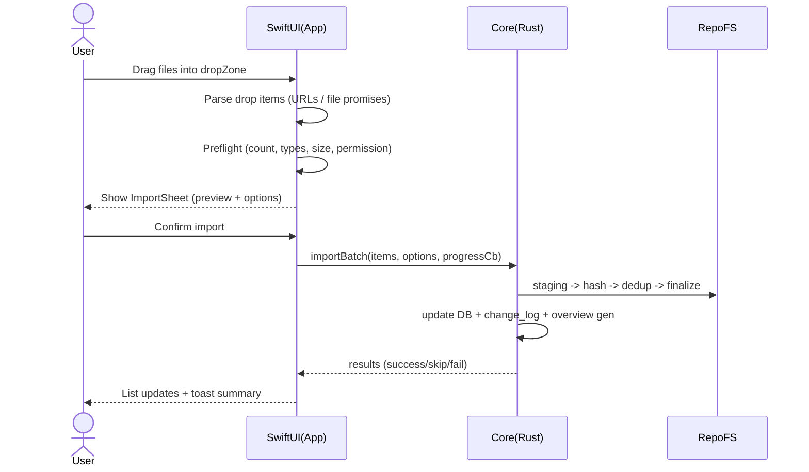
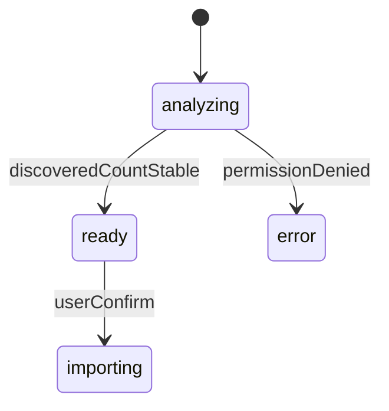
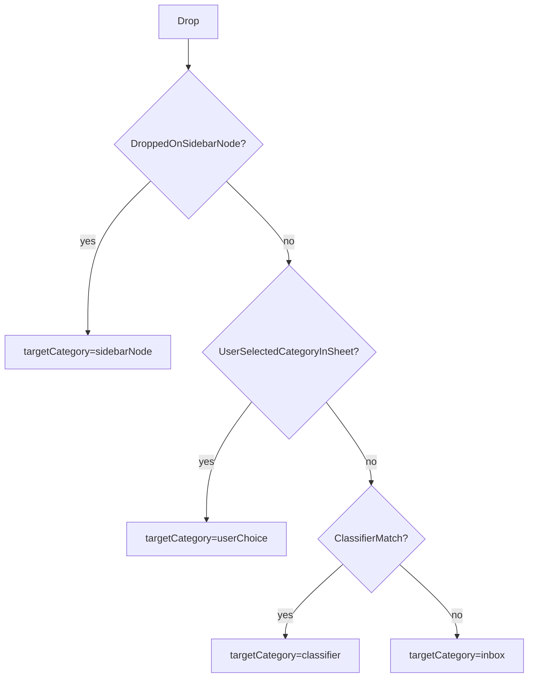

# 拖拽导入流程（Drag & Drop Import Flow）

> 定义 AreaMatrix 的拖拽导入 UX：从“用户把文件拖进来”到“文件落位、分类、命名、概览更新、列表可见”的全链路交互。包含触发入口矩阵、hover/drop 视觉态、ImportSheet（Move/Copy/Index）、多文件/文件夹/跨应用拖入分支、失败恢复与撤销。
>
> 阅读时长：约 18 分钟。

---

## 目标与成功标准

### 目标

1. **一拖即用**：拖入即出现 ImportSheet，默认选项合理，确认后 1 秒内列表可见（不含大文件 hash）。
2. **用户不做工程决策**：用户只做“我想怎么处理源文件（Move/Copy/Index）”与“是否接受分类/命名建议”两类决策。
3. **可逆且可解释**：任何导入都能在改动时间线里看到，失败能恢复，取消不留半文件。
4. **批量友好**：拖入多个文件/文件夹时，能批量确认/批量处理，进度清晰。
5. **符合 macOS 习惯**：支持 Finder 拖拽、Dock 图标拖拽、从 Mail/Safari 下载项拖拽（尽可能）。

### 成功标准（验收）

- **I1**：拖入 1 个小文件（< 10MB）→ 点击确认 → 1 秒内列表出现。
- **I2**：拖入 20 个文件 → 先出现“批量 ImportSheet”→ 可一键应用同一策略。
- **I3**：拖入文件夹 → 能提示“将递归导入 N 个文件（可排除 .DS_Store 等）”。
- **I4**：拖入不可访问文件（无权限/已删除）→ 给出错误并继续处理其他文件。
- **I5**：用户点取消（在 ImportSheet）→ **不发生任何 FS 变更**。
- **I6**：导入过程中强制终止 App → 下次启动自动恢复/清理（与事务式导入一致）。

---

## 谁会使用这份文档

- **macOS 工程师**：实现 DragTarget、ImportSheet、进度 UI、错误提示与撤销入口。
- **Core 工程师**：对齐批量导入 API、进度回调、去重提示、staging 清理行为。
- **产品/设计**：锁定默认策略、文案与分支行为（尤其 Move/Index 的风险说明）。

---

## 关键概念（首次出现术语）

- Drop zone（投放区）：窗口中可接受拖入的区域。
- ImportSheet：拖入后出现的确认面板（macOS 常见的 sheet）。
- Storage mode（存储模式）：Move / Copy / Index（仅索引）。
- Staging（暂存区）：导入先落到 `.areamatrix/staging/`，保证事务性。
- Dedup（去重）：以 SHA256 判断内容重复。

---

## 触发入口矩阵（用户从哪里拖进来）

| 入口 | 支持 | 说明 |
|---|---|---|
| 主窗口（空态/正常态）拖入 | 必须 | 主路径 |
| 侧边栏树节点上拖入 | 必须 | 作为“目标分类”显式指定 |
| 文件列表区域拖入 | 必须 | 目标=当前选中的分类/节点 |
| App Dock 图标拖入 | 应支持 | 作为“导入到当前 repo”的快捷入口 |
| 菜单 File → Import…（非拖拽） | 建议 | 作为无法拖拽用户的替代（与本篇共享 ImportSheet） |
| 从 Mail 附件拖入 | 尽可能 | 可能先落到临时目录；仍按普通文件处理 |
| 从 Safari 下载条拖入 | 尽可能 | 依赖 macOS 具体行为；失败时提示“请先保存到 Finder 再拖入” |

---

## 总体流程（高层）



---

## Drop zone 与视觉态

### Drop zone 覆盖范围

1. **空态**：整个主窗口主体区域是 drop zone（让新用户“哪里都能拖”）。
2. **正常态**：至少文件列表区域 + 侧边栏都可 drop。\n
   - 侧边栏 drop → 目标分类=被 drop 的节点\n
   - 列表区域 drop → 目标分类=当前选中节点\n

### Hover / Drop 视觉态（不画图，用文字+ASCII）

#### Hover（拖拽进入窗口）

- 窗口出现浅色边框高亮（可与系统 accent color 一致）
- drop zone 显示一行提示：\n
  - “导入到：<当前分类>（可拖到侧边栏其他分类以改变目标）”

```
┌──────────────────────────────────────────────────────────────────────────────┐
│ AreaMatrix                                                                    │
│ ┌───────────────┐  导入到：docs  （拖到左侧分类可改变目标）                    │
│ │ docs          │  ┌────────────────────────────────────────────────────────┐ │
│ │ code          │  │                                                        │ │
│ │ design        │  │   Drop files to import                                 │ │
│ │ ...           │  │                                                        │ │
│ └───────────────┘  └────────────────────────────────────────────────────────┘ │
└──────────────────────────────────────────────────────────────────────────────┘
```

#### Hover（拖到侧边栏节点上）

- 节点高亮（背景+边框）
- tooltip：`Import into "<category>"`（中文 UI 显示“导入到「文档」”）

#### Drop（放下那一刻）

1. 立刻出现 ImportSheet（sheet 由窗口顶部滑下）
2. 背景区域变为不可交互（符合 sheet）

---

## ImportSheet：单文件版（核心）

### 什么时候出现单文件版

- drop items 预解析后：**只有 1 个文件**（不含文件夹）
- 若是 1 个文件夹 → 走“文件夹版”（见后文）

### 单文件 ImportSheet 的信息结构

1. **文件预览**：文件名、图标、大小、来源路径（脱敏：仅显示 `~`）
2. **建议分类**：Classifier 的推荐（可更改）
3. **建议命名**：推荐新文件名（可编辑）
4. **存储模式**：Move / Copy / Index（附风险提示）
5. **冲突/重复提示**：如果检测到同名或 hash 重复，在这里提前呈现（不进度条后置）
6. **按钮**：Cancel / Import

### 单文件 ImportSheet（ASCII）

```
┌──────────────────────────────────────────────────────────────────────────────┐
│ 导入 1 个文件                                                                  │
│                                                                              │
│  文件： [PDF icon]  合同.pdf                                                   │
│  大小： 1.2 MB                                                                 │
│  来源： ~/Downloads/合同.pdf                                                   │
│                                                                              │
│  建议分类： [ docs ▾ ]   （为什么？）                                          │
│  建议命名： [ 2026Q1_合同_客户A.pdf ____________________________ ]            │
│                                                                              │
│  存储模式： (●) Copy   ( ) Move   ( ) Index-only                              │
│          Copy：保留原文件。Move：从原位置移走。Index：不复制，仅记录索引。       │
│                                                                              │
│  冲突：无                                                                       │
│                                                                              │
│  [ Cancel ]                                                   [ Import ]     │
└──────────────────────────────────────────────────────────────────────────────┘
```

### 交互细节（逐项）

#### “为什么？”（分类解释）

点击后弹 popover（不跳页）：

- 命中规则：扩展名/关键词/优先级
- 置信度：高/中/低（规则引擎可推导：扩展名命中=高，关键词命中=中，兜底=inbox=低）
- 操作：`Change rules…`（跳到 `classifier-calibration.md`，见 U4）

#### 分类下拉（建议分类 → 手动更改）

- 下拉列表按“常用 + 最近使用 + 全部分类”分组
- 允许临时导入到 `inbox`（即使推荐为 docs）
- 侧边栏节点作为 drop 目标时：默认分类=该节点（覆盖 classifier 推荐）

#### 建议命名输入框

- 默认可编辑
- 自动选中“主体部分”，便于用户直接改
- 保存时自动修正非法字符（macOS 文件名禁止 `:` 等）
- 显示冲突预告：若目标文件名已存在，提示“将自动追加序号（2）”

#### 存储模式说明（重要）

对 Move / Index 要给“风险提示”但不恐吓：

- **Copy（默认）**：最安全，保留来源文件。
- **Move**：导入后来源文件消失。适用于下载目录整理。
- **Index-only**：不复制，不移动。适用于超大文件或外部硬盘。
  - 额外提示：如果源文件被删除/移动，索引会失效（UI 会标“missing”）。

对 Index-only 的提示建议用 info icon（ℹ︎），点击展开：

> Index-only 不会把文件放进资料库，只记录引用路径。若你移动/删除源文件，该条目将变为“缺失”。你可以稍后执行“Materialize”（把它复制进资料库）。

（Materialize 行为属于 Stage 2/3，但提示先占位。）

---

## ImportSheet：多文件版（Batch）

### 触发条件

- drop items ≥ 2（文件+文件夹混合时，先展开文件夹得到最终 file list，见后文）

### 设计原则

1. **批量应用同一策略**：分类、存储模式、命名策略可一键应用。
2. **允许逐项覆盖**：对少数例外允许单独改。
3. **先总览后细节**：先告诉用户“你将导入 N 个文件、总大小 X”，然后提供“展开列表”。

### 多文件 ImportSheet（ASCII）

```
┌──────────────────────────────────────────────────────────────────────────────┐
│ 导入 20 个文件                                                                 │
│                                                                              │
│  总大小： 512 MB    来源：Finder 拖入                                           │
│                                                                              │
│  批量设置：                                                                    │
│    导入到： [ 自动分类（推荐） ▾ ]   （可选：指定分类）                         │
│    存储模式： (●) Copy   ( ) Move   ( ) Index-only                              │
│    命名策略： [ 使用建议命名（推荐） ▾ ]                                        │
│              • 保留原名  • 使用建议命名  • 统一前缀…  • 仅标准化字符            │
│                                                                              │
│  项目（可展开）：  [▶] 查看 20 个项目                                           │
│                                                                              │
│  预计：重复 2 个，重名冲突 1 个                                                 │
│                                                                              │
│  [ Cancel ]                                                   [ Import ]     │
└──────────────────────────────────────────────────────────────────────────────┘
```

### 展开列表视图（批量）

展开后显示表格：

- icon, 原名, 建议分类, 建议新名, 冲突标记
- 点击某行可单独改分类/命名（不离开 sheet）

```
┌──────────────────────────────────────────────────────────────────────────────┐
│ 项目列表（20）                                                                 │
│                                                                              │
│  [PDF] 合同.pdf     分类：docs   名称：2026Q1_合同.pdf        状态：OK          │
│  [PNG] IMG_001.png  分类：media  名称：2026-04-28_screenshot.png 状态：OK      │
│  [PDF] 报告.pdf     分类：docs   名称：报告.pdf                状态：DUP        │
│                                                                              │
│  说明：DUP=内容重复；NAME=重名冲突                                              │
└──────────────────────────────────────────────────────────────────────────────┘
```

---

## 文件夹拖入（Folder Import）

### 触发条件

- drop items 中包含目录 URL

### 目录展开规则

- 递归遍历（深度不限），但必须有 **排除规则**：
  - 默认排除：`.DS_Store`、`.git/`、`.areamatrix/`、`node_modules/`（可配置）
  - 默认排除隐藏文件：以 `.` 开头（可在高级选项开启导入）
  - 符号链接：默认不跟随（避免无限循环）

### 文件夹 ImportSheet（ASCII）

```
┌──────────────────────────────────────────────────────────────────────────────┐
│ 导入文件夹                                                                     │
│                                                                              │
│  文件夹： ~/Downloads/客户A/                                                   │
│                                                                              │
│  将导入： 143 个文件（排除 12 个隐藏/系统文件）                                 │
│  预计总大小： 2.8 GB                                                           │
│                                                                              │
│  选项：                                                                        │
│   [✓] 递归导入子文件夹                                                         │
│   [ ] 包含隐藏文件（.开头）                                                     │
│   [ ] 跟随符号链接（不推荐）                                                    │
│                                                                              │
│  批量设置（同多文件版）…                                                       │
│                                                                              │
│  [ Cancel ]                                                   [ Import ]     │
└──────────────────────────────────────────────────────────────────────────────┘
```

### 大目录预估与“先计算再导入”问题

为了避免用户等很久才看到 sheet：

- drop 后先显示 sheet 的“正在分析文件夹…”占位态
- 允许先展示“已发现 N 个文件（持续增长）”，并在 N 稳定后启用 Import 按钮



---

## 跨应用拖入（Mail / Safari / 截图等）

### 原则

UI 不应假设拖入的永远是“稳定的文件 URL”。某些来源可能是：

- file promise（承诺稍后写入）
- 临时文件（放在沙盒/缓存）

产品侧策略：

1. **尽最大努力转换为稳定文件 URL**。
2. 失败时给出明确提示：
   - “请先保存到 Finder，再拖入 AreaMatrix。”

### 失败提示（ASCII）

```
┌──────────────────────────────────────────────────────────────────────────────┐
│ 无法导入该项目                                                                 │
│                                                                              │
│  这个项目来自某个应用（例如邮件附件或网页下载），当前无法直接访问文件内容。     │
│                                                                              │
│  你可以：                                                                      │
│  • 先把它保存到 Finder，然后再拖入 AreaMatrix                                  │
│                                                                              │
│  [ OK ]                                                                       │
└──────────────────────────────────────────────────────────────────────────────┘
```

---

## 冲突与去重在 ImportSheet 的呈现（与 U5 对齐）

导入前就提示冲突，有两个好处：

- 用户在确认前就理解会发生什么
- 避免导入到一半才弹对话框打断批量流程

### 冲突类型

| 类型 | 检测 | ImportSheet 展示 |
|---|---|---|
| 内容重复（hash dup） | 计算 SHA256 后 | “重复：与 <existing> 相同” + 选项 |
| 重名冲突（同名不同内容） | 目标路径存在但 hash 不同 | “重名：将自动改名 / 或询问” |
| 同目录冲突（同分类同名） | 同上 | 与重名合并 |

### 单文件重复的选项（推荐 3 个）

- `Skip`（跳过导入）
- `Keep both`（保留两份，自动编号）
- `Replace`（替换现有文件，危险操作，需二次确认）

批量时默认策略：

- 对重复文件默认 `Skip`，并在结果摘要中提示“跳过 N 个重复文件”。

---

## 导入执行期间 UI（进度、取消、错误）

### 进度呈现方式

导入确认后，sheet 切换为进度视图（不关闭，避免“点了没反应”）：

```
┌──────────────────────────────────────────────────────────────────────────────┐
│ 正在导入…（12 / 20）                                                          │
│                                                                              │
│  当前：IMG_0123.png                                                           │
│  阶段：hash（43%）                                                            │
│                                                                              │
│  总进度： ████████████░░░░░░░░░  60%                                          │
│                                                                              │
│  [ Run in background ]                                      [ Cancel ]       │
└──────────────────────────────────────────────────────────────────────────────┘
```

### Run in background

点击后：

- 关闭 sheet
- 主界面顶部出现小进度条（或 toolbar indicator）
- 结束后 toast 总结（成功/失败/跳过数量）

### Cancel（取消）策略

取消导入是高复杂度能力，建议 Stage 1 的产品策略：

- **允许取消等待队列**：未开始处理的项直接取消
- **正在处理的当前项**：允许“当前项完成后停止”
  - 用语：`Stop after current file`（中文“处理完当前文件后停止”）
- 取消后必须保证：
  - staging 已清理
  - DB 不存在 “staging” 悬挂记录

工程实现参考：`docs/architecture/transactional-import.md` 的 staging GC 与恢复逻辑。

---

## 导入完成后的反馈（总结 + 下一步）

### 成功 toast（单文件）

- “已导入到 docs：2026Q1_合同_客户A.pdf”

### 批量总结 toast（多文件）

- “导入完成：成功 17，跳过 2（重复），失败 1（无权限）”

### 导入后自动行为

1. 若用户导入到当前选中分类：列表自动滚动到新条目并高亮 2 秒
2. 详情面板自动打开该条目的“元数据”Tab
3. 侧边栏该分类的计数更新（如果显示计数）

---

## 与主界面交互（目标分类规则）

### 目标分类优先级（从高到低）

1. **用户 drop 到侧边栏具体节点** → 目标=该分类
2. 用户在 ImportSheet 手动选择分类
3. Classifier 推荐分类
4. 兜底 `inbox`



---

## 文案（中英对照，关键按钮）

| Key | 中文 | English |
|---|---|---|
| importSheet.title.single | 导入 1 个文件 | Import 1 item |
| importSheet.title.multi | 导入 %d 个文件 | Import %d items |
| importSheet.mode.copy | 复制（推荐） | Copy (Recommended) |
| importSheet.mode.move | 移动 | Move |
| importSheet.mode.index | 仅索引 | Index-only |
| importSheet.cancel | 取消 | Cancel |
| importSheet.import | 导入 | Import |
| importSheet.background | 后台运行 | Run in background |
| importSheet.stopAfterCurrent | 处理完当前文件后停止 | Stop after current file |
| import.toast.single | 已导入到 %s：%s | Imported to %s: %s |
| import.toast.summary | 导入完成：成功 %d，跳过 %d，失败 %d | Import finished: %d success, %d skipped, %d failed |

---

## 测试用例（产品验收清单）

### 单文件

- [ ] 拖入 PDF → 出现单文件 ImportSheet，默认 Copy，分类推荐正确
- [ ] 修改建议命名为非法字符 → 自动修正或提示
- [ ] 选择 Move → 提示“源文件将被移走”，确认后源路径为空
- [ ] 选择 Index-only → 导入后 repo 内无新文件，但列表出现条目且标“indexed”

### 多文件/文件夹

- [ ] 拖入 20 文件 → 多文件 ImportSheet，可批量设置并逐项覆盖
- [ ] 拖入包含隐藏文件的文件夹 → 默认排除隐藏文件并显示数量
- [ ] 大文件夹分析阶段 → 计数递增，稳定后启用 Import

### 冲突

- [ ] 拖入重复文件 → sheet 显示重复并默认 Skip（批量）
- [ ] 拖入重名不同内容 → sheet 提示将自动编号或询问策略（见 U5）

### 异常

- [ ] 拖入无权限文件 → 不影响其他文件导入，结果摘要含失败原因
- [ ] 导入中 kill app → 下次启动可恢复/清理 staging 残留

---

## Related

- [../product/prd.md](../product/prd.md)
- [../modules/storage.md](../modules/storage.md)
- [../modules/classify.md](../modules/classify.md)
- [../modules/overview-gen.md](../modules/overview-gen.md)
- [../modules/change-log.md](../modules/change-log.md)
- [../architecture/transactional-import.md](../architecture/transactional-import.md)
- [../architecture/fs-watcher.md](../architecture/fs-watcher.md)
- [../architecture/source-of-truth.md](../architecture/source-of-truth.md)
- [dedup-conflict.md](dedup-conflict.md)
- [classifier-calibration.md](classifier-calibration.md)
