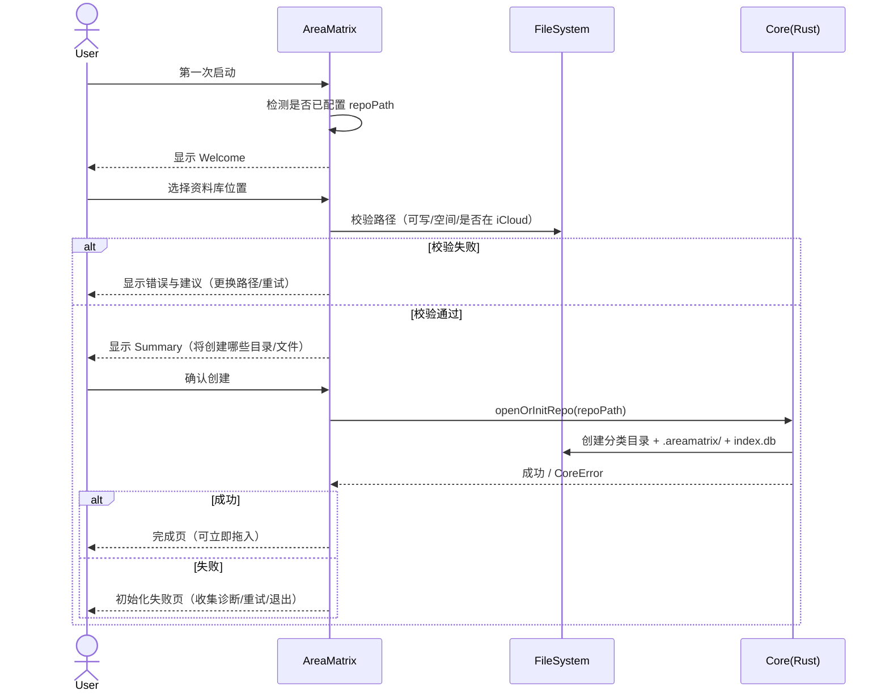
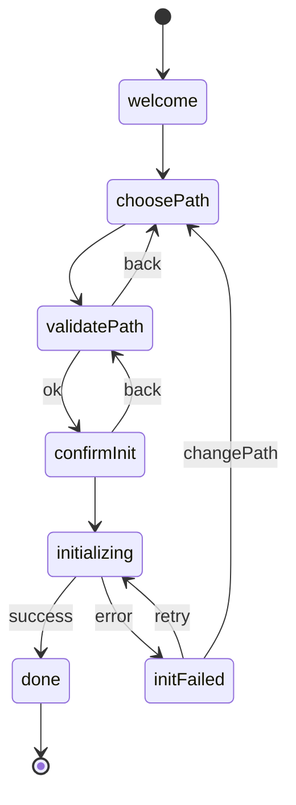

# 首次启动向导（First Launch Wizard）

> 定义 AreaMatrix 第一次启动时的完整交互流程：选择资料库位置、初始化结构、处理 iCloud / 权限 / 磁盘空间异常，并确保用户在任意步骤都能安全退出与恢复。
>
> 阅读时长：约 15 分钟。

---

## 目标与成功标准

### 目标

1. **3 分钟内完成初始化**：用户从安装到“可以拖入第一个文件”路径尽量短。
2. **不做隐式破坏**：不在用户不理解的情况下移动/删除任何文件。
3. **失败可恢复**：任意失败都能回到向导继续，或退出后下次继续。
4. **路径透明**：用户明确知道资料库在哪、里面有什么、卸载后是否仍可用（与 PRD 原则一致）。
5. **iCloud 友好**：对 iCloud 路径给出清晰提示与风险说明（但不禁止）。

### 成功标准（验收）

- **S1**：新用户首次启动从点击 App 到进入主界面（可拖拽）≤ 60 秒（不含下载 iCloud 文件）。
- **S2**：选择不可写路径时给出明确原因与“更换路径”按钮，无 crash。
- **S3**：选择 iCloud 路径时弹“iCloud 风险提示”，用户必须明确确认（一次性）。
- **S4**：初始化过程被强制终止（kill app）后，下次启动能自动恢复到“继续初始化/清理残留”。
- **S5**：向导所有页面支持键盘（Tab/Enter/Esc）完成主流程。

---

## 谁会使用这份文档

- **产品/设计**：确定每一步该问什么、给什么承诺、用什么文案。
- **macOS 工程师**：照着实现 SwiftUI 的页面、状态机、按钮行为与错误处理。
- **Core 工程师**：对齐初始化所需的 Core API、错误码与诊断日志要求。

---

## 关键概念（首次出现术语）

- Repository / Repo（资料库）：用户在文件系统中的 AreaMatrix 根目录（默认 `~/AreaMatrix/`）。
- Staging area（Staging 区）：`.areamatrix/staging/`，用于事务式导入的临时区。
- Schema version（模式版本）：SQLite schema 的整数版本号，参见 `docs/architecture/migration.md`。
- Placeholder file（占位符）：iCloud 未下载文件的本地占位（`.icloud`），参见 `docs/adr/0006-icloud-support.md`。

---

## 向导整体流程（高层）



---

## 页面与状态机

### 页面列表

| PageId | 页面 | 目的 | 主要按钮 |
|---|---|---|---|
| welcome | 欢迎页 | 解释产品承诺与本地优先 | `Continue` |
| choosePath | 选择资料库路径 | 选择或确认默认路径 | `UseDefault` / `Choose…` |
| validatePath | 校验与风险提示 | iCloud/权限/空间等检查与确认 | `Back` / `Continue` |
| confirmInit | 初始化确认 | 展示将创建的结构 | `Back` / `CreateRepository` |
| initializing | 初始化中 | 显示进度 + 可取消 | `Cancel`（可选） |
| initFailed | 初始化失败 | 提供重试与诊断导出 | `Retry` / `CollectDiagnostics` |
| done | 完成 | 给“下一步操作” | `OpenRepository` |

### 全局状态机（简化）



---

## 逐页规格（Wireframe 级）

> 说明：以下 ASCII 框图以 80 字符宽为目标，可直接放进 issue/PR 评论讨论。

### 1) welcome（欢迎页）

#### UI 布局

```
┌──────────────────────────────────────────────────────────────────────────────┐
│ AreaMatrix                                                                    │
│                                                                              │
│  把文件拖进来，AreaMatrix 替你分类、命名、记账。                                │
│                                                                              │
│  我们的承诺：                                                                  │
│  • 真相在文件系统：你的资料库就是普通文件夹，Finder 也能直接打开。              │
│  • 本地优先：默认不上传任何数据。                                              │
│  • 可逆：删除走回收站，记录有时间线。                                          │
│                                                                              │
│  [ Learn more… ]                                                             │
│                                                                              │
│                                                     [ Continue → ]           │
└──────────────────────────────────────────────────────────────────────────────┘
```

#### 交互

- 点击 `Continue` → 进入 `choosePath`
- `Learn more…` 打开 `docs/product/prd.md` 对应内容的应用内帮助页（或外链）

#### 文案（中英对照）

| Key | 中文 | English |
|---|---|---|
| welcome.title | AreaMatrix | AreaMatrix |
| welcome.subtitle | 把文件拖进来，AreaMatrix 替你分类、命名、记账。 | Drop files in. AreaMatrix classifies, names, and tracks changes. |
| welcome.promise1 | 真相在文件系统：资料库是普通文件夹。 | Filesystem is the source of truth: your repo is a normal folder. |
| welcome.promise2 | 本地优先：默认不上传任何数据。 | Local-first: nothing is uploaded by default. |
| welcome.promise3 | 可逆：删除走回收站，改动可追溯。 | Reversible: deletions go to Trash, changes are traceable. |
| welcome.cta | 继续 | Continue |

---

### 2) choosePath（选择资料库路径）

#### 默认路径规则

- 默认建议：`~/AreaMatrix/`
- 若该路径已存在但不是 AreaMatrix repo：提示“已存在同名文件夹”，建议改名或选择新路径。
- 若用户上次未完成初始化（存在 `repoPath` 配置但 repo 不完整）：直接跳到 `validatePath` 并提示“继续初始化”。

#### UI 布局

```
┌──────────────────────────────────────────────────────────────────────────────┐
│ 选择资料库位置                                                                 │
│                                                                              │
│  资料库是一个普通文件夹，你可以随时在 Finder 中访问。                           │
│                                                                              │
│  推荐位置：                                                                    │
│    ~/AreaMatrix/                                                              │
│                                                                              │
│  你也可以选择其他位置：                                                        │
│    • 外置硬盘（更大容量）                                                      │
│    • iCloud Drive（跨设备同步，但有延迟与冲突风险）                             │
│                                                                              │
│  路径： [ ~/AreaMatrix/ ________________________________________ ] [ Choose… ]│
│                                                                              │
│  提示：不建议放在 Downloads（容易误删/清理）。                                  │
│                                                                              │
│  [ Use default ]                                             [ Continue → ] │
└──────────────────────────────────────────────────────────────────────────────┘
```

#### 交互

- `Use default`：将路径置为默认并继续
- `Choose…`：弹系统 `NSOpenPanel`（仅选目录）
- `Continue`：进入 `validatePath`
- `⌘,`：无效（未进入主界面）
- `Esc`：弹确认对话“退出向导？下次启动继续”（可取消）

#### 校验前置（同步快速）

在点击 Continue 后立即做 **轻校验**（无需 IO 重）：\n
- 路径字符串合法（非空、可解析）
- 不允许选择 `.areamatrix/` 子目录（必须是 repo 根目录）

重校验留给 `validatePath`（带 spinner）。

---

### 3) validatePath（校验与风险提示）

此页是“决策收口页”：把所有风险一次性交代清楚，让用户确认后才创建任何东西。

#### 需要检查的项目

| Check | 方式 | 失败时处理 |
|---|---|---|
| 可写权限 | `FileManager.isWritableFile` + 试建临时文件 | 显示错误 + “更换路径” |
| 磁盘空间 | `URLResourceValues.volumeAvailableCapacityForImportantUsage` | 空间不足 → 提示建议空间阈值 |
| 是否 iCloud | path 前缀/资源属性（见 iCloud ADR） | 进入 iCloud 提示卡片（需确认） |
| 是否外置卷 | `volumeIsRemovable` / `volumeIsEjectable` | 显示“外置卷注意事项”提示 |
| 是否已存在 repo | 检测 `.areamatrix/index.db` + schema | 存在 repo → 进入“打开/继续”分支 |

#### UI 布局（正常通过）

```
┌──────────────────────────────────────────────────────────────────────────────┐
│ 检查资料库位置                                                                 │
│                                                                              │
│  路径： ~/AreaMatrix/                                                         │
│                                                                              │
│  ✓ 可写权限                                                                    │
│  ✓ 可用空间： 32.4 GB                                                          │
│  ✓ 非 iCloud 路径                                                               │
│  ✓ 非外置卷                                                                     │
│                                                                              │
│  接下来将创建：                                                                │
│  • docs/  code/  design/  finance/  media/  inbox/                             │
│  • .areamatrix/index.db（本地索引）                                            │
│                                                                              │
│  [ Back ]                                                    [ Continue → ]  │
└──────────────────────────────────────────────────────────────────────────────┘
```

#### UI 布局（检测到 iCloud）

```
┌──────────────────────────────────────────────────────────────────────────────┐
│ 检查资料库位置                                                                 │
│                                                                              │
│  路径： ~/Library/Mobile Documents/com~apple~CloudDocs/AreaMatrix/             │
│                                                                              │
│  ✓ 可写权限                                                                    │
│  ✓ 可用空间： 12.1 GB                                                          │
│  ⚠ iCloud Drive 路径                                                           │
│                                                                              │
│  iCloud 提示：                                                                 │
│  • 文件可能以“.icloud”占位符出现，需要下载后才能读写。                          │
│  • 多设备同时编辑可能产生“Conflicted Copy”。                                   │
│  • 同步延迟由 iCloud 决定（网络/配额）。                                        │
│                                                                              │
│  你仍然可以继续（推荐先用本地路径体验）。                                      │
│                                                                              │
│  [ Switch to local… ]                                   [ I understand → ]   │
└──────────────────────────────────────────────────────────────────────────────┘
```

#### iCloud 继续条件

- 用户必须点击 `I understand →` 才能进入下一步（相当于一次性确认）
- App 将 `didAcknowledgeICloudRepoRisk=true` 写入本地设置（仅对当前 repoPath 生效）

#### 失败态（不可写）

```
┌──────────────────────────────────────────────────────────────────────────────┐
│ 无法写入该位置                                                                 │
│                                                                              │
│  路径： /System/Applications/                                                  │
│                                                                              │
│  原因：该目录需要管理员权限，AreaMatrix 不能在这里创建资料库。                  │
│                                                                              │
│  建议：选择你的主目录或外置硬盘中的一个空文件夹。                               │
│                                                                              │
│  [ Choose another folder… ]                                  [ Back ]        │
└──────────────────────────────────────────────────────────────────────────────┘
```

#### 失败态（空间不足）

空间不足不应仅提示“空间不够”，需给出“需要多少”与“为什么需要”。推荐阈值：\n
- 最小：1GB（DB + logs + staging）
- 推荐：5GB（更少遇到 hash / staging 占满）

```
┌──────────────────────────────────────────────────────────────────────────────┐
│ 可用空间不足                                                                   │
│                                                                              │
│  路径： ~/AreaMatrix/                                                         │
│  可用空间： 320 MB                                                            │
│                                                                              │
│  AreaMatrix 需要至少 1 GB 可用空间以创建索引与 staging 区。                     │
│                                                                              │
│  你可以：                                                                      │
│  • 释放磁盘空间后重试                                                          │
│  • 选择一个有更多空间的位置（外置硬盘）                                        │
│                                                                              │
│  [ Retry ]                                      [ Choose another folder… ]   │
└──────────────────────────────────────────────────────────────────────────────┘
```

---

### 4) confirmInit（初始化确认）

#### 目的

在**真正创建任何东西之前**，再次让用户确认“会产生哪些文件/目录”，并给出“撤销/卸载是否影响资料库”的承诺。

#### UI 布局

```
┌──────────────────────────────────────────────────────────────────────────────┐
│ 创建资料库                                                                     │
│                                                                              │
│  位置： ~/AreaMatrix/                                                         │
│                                                                              │
│  将创建以下结构（你可以在 Finder 中看到并自行管理）：                           │
│                                                                              │
│  AreaMatrix/                                                                  │
│    docs/  code/  design/  finance/  media/  inbox/                            │
│    README.md                                                                  │
│    .areamatrix/                                                               │
│      index.db                                                                 │
│      logs/                                                                    │
│      staging/                                                                 │
│                                                                              │
│  说明：卸载应用不会删除你的资料库文件夹。                                      │
│                                                                              │
│  [ Back ]                                              [ Create repository ] │
└──────────────────────────────────────────────────────────────────────────────┘
```

#### 交互

- `Create repository` → `initializing`
- `Back` → 回到 `validatePath`

---

### 5) initializing（初始化中）

#### 进度模型（产品侧）

初始化可分 4 步，每步完成前 UI 不要跳动，建议做“步骤列表 + 当前步骤 spinner”：

1. 创建目录结构（分类目录 + `.areamatrix/`）
2. 初始化 SQLite（PRAGMA + schema + migration）
3. 写入初始 README（根 README + 分类 README）
4. 写入配置（repo_config / 本地设置）

#### UI 布局

```
┌──────────────────────────────────────────────────────────────────────────────┐
│ 正在创建资料库…                                                               │
│                                                                              │
│  • 创建目录结构                           ✓                                   │
│  • 初始化数据库                           ⏳                                   │
│  • 生成 README                            ○                                   │
│  • 保存配置                               ○                                   │
│                                                                              │
│  这通常需要几秒钟。                                                           │
│                                                                              │
│  [ Cancel ]                                                                   │
└──────────────────────────────────────────────────────────────────────────────┘
```

#### Cancel 规则

- **推荐**：允许取消，但取消必须做到“无半初始化 repo”。\n
  取消会触发 Core 执行清理：如果已创建 `.areamatrix/index.db` 但 schema 不完整，则删除 `.areamatrix/` 并保留用户选择的空目录本身（避免误删用户目录）。\n
- 如果取消实现成本过高：可先不提供 Cancel（Stage 1），但要确保初始化极快。

---

### 6) initFailed（初始化失败）

#### 目的

失败页必须同时满足：

- 用户看得懂（是什么问题）
- 用户能做事（下一步是什么：换路径/重试/导出诊断包）
- 工程师能定位（错误码、日志位置、诊断包按钮）

#### UI 布局（通用）

```
┌──────────────────────────────────────────────────────────────────────────────┐
│ 创建失败                                                                       │
│                                                                              │
│  我们没能完成资料库初始化。                                                   │
│                                                                              │
│  错误：Database locked                                                        │
│  说明：可能同时打开了两个 AreaMatrix 实例，或该目录被其他程序占用。              │
│                                                                              │
│  你可以：                                                                      │
│  [ Retry ]   [ Change folder… ]   [ Collect diagnostics… ]                   │
│                                                                              │
│  诊断信息将保存在你的本地，不会自动上传。                                      │
└──────────────────────────────────────────────────────────────────────────────┘
```

#### 诊断包内容（产品视角）

按钮 `Collect diagnostics…` 应打包并给出保存位置（zip）：\n
- `.areamatrix/logs/`（Rust tracing rolling logs）\n
- OSLog 最近 24h（仅 subsystem=`com.areamatrix.app`）\n
- `index.db` 的 `PRAGMA integrity_check` 输出（若存在）\n
- `schema_version` 与关键表行数统计（files/change_log）\n
- `.areamatrix/staging/` 列表\n
- 系统信息：macOS 版本、CPU 架构、内存\n
\n
细节实现参考：`docs/development/observability.md` 的“诊断包导出脚本”章节。

#### 常见失败分类（建议映射文案）

| 类别 | 典型 CoreError | 用户提示要点 | 主按钮 |
|---|---|---|---|
| 权限问题 | Permission / Io: EACCES | 换路径，必要时提示“授予全磁盘访问” | Change folder |
| 空间不足 | Io: ENOSPC | 释放空间或换盘 | Change folder |
| DB 锁 | Db: busy/locked | 关闭重复实例，重试 | Retry |
| iCloud 未登录 | ICloudPlaceholder / Permission | 登录 iCloud 或换本地路径 | Change folder |
| 目录非空冲突 | AlreadyExists | 选新目录或允许“接管现有 repo” | Change folder |

---

### 7) done（完成）

#### UI 布局

```
┌──────────────────────────────────────────────────────────────────────────────┐
│ 准备好了                                                                       │
│                                                                              │
│  资料库已创建： ~/AreaMatrix/                                                  │
│                                                                              │
│  下一步：                                                                      │
│  1) 把文件拖到窗口里                                                           │
│  2) AreaMatrix 会自动分类、命名，并生成 README                                 │
│                                                                              │
│  [ Open in Finder ]                                        [ Start using → ] │
└──────────────────────────────────────────────────────────────────────────────┘
```

#### 交互

- `Open in Finder`：打开 repoPath（让用户确认“真相在文件系统”）
- `Start using`：进入主界面（树/列表/详情）

---

## 复用与跳过逻辑（非首次启动）

向导仅在以下情况出现：

1. **完全未配置 repoPath**（真正第一次启动）
2. **repoPath 已配置但 repo 不完整**（上次初始化中断）
3. 用户显式在设置中“更换资料库路径”并选择“重新初始化”

若检测到 repo 已存在且完整：

- 直接进入主界面（不进入向导）
- 或显示一个极短的 “Welcome back” 屏：仅展示 repoPath + `Open`（可选）

---

## 与工程文档的对齐点（实现提醒）

### iCloud 行为

- 本页只定义**提示与确认**，具体占位符状态机与协调读取实现，见：\n
  - `docs/adr/0006-icloud-support.md`\n
  - `docs/architecture/fs-watcher.md`\n

### 初始化内容的 SoT 承诺

产品层承诺“真相在文件系统”，工程层实现是“DB 是元数据真相”。向导文案必须保持一致：\n
- 向用户强调：卸载 app 不会删除 repo\n
- 发生 DB 损坏：仍可用 Finder 访问文件，但应用功能可能受限（可在错误页提示“修复索引/重建索引”）

参见：`docs/architecture/source-of-truth.md`。

### 诊断与日志

向导失败页要提供诊断包导出入口，具体日志体系见：`docs/development/observability.md`。

---

## 测试用例（产品验收清单）

### 基础

- [ ] 新安装首次启动，使用默认路径创建成功
- [ ] 选择一个空目录创建成功
- [ ] 选择非空目录（含用户文件）→ 明确提示“不会删除该目录内容”，并阻止/或要求选择子目录

### 权限

- [ ] 选择 `/System` 等不可写路径 → 给出清晰原因
- [ ] 选择外置硬盘只读分区 → 提示“该卷只读”

### iCloud

- [ ] 选择 iCloud 路径 → 弹 iCloud 风险提示且必须确认
- [ ] iCloud 未登录 / 配额不足场景 → 文案可理解，能换路径继续

### 中断恢复

- [ ] initializing 过程中 kill app → 下次启动能继续或清理残留
- [ ] initFailed 页面点击 Collect diagnostics 能生成 zip

### 可访问性与键盘

- [ ] 全流程可用 Tab/Enter 完成
- [ ] Esc 可退出并提示“下次继续”

---

## Related

- [../product/prd.md](../product/prd.md)
- [../development/setup.md](../development/setup.md)
- [../development/observability.md](../development/observability.md)
- [../architecture/source-of-truth.md](../architecture/source-of-truth.md)
- [../architecture/fs-watcher.md](../architecture/fs-watcher.md)
- [../architecture/transactional-import.md](../architecture/transactional-import.md)
- [../adr/0006-icloud-support.md](../adr/0006-icloud-support.md)

