# Stage 2 体验完善逐页 UI 开发规格

> Stage 2 目标：在 Stage 1 稳定闭环之上加入搜索、标签、Undo、批量操作、命令面板、自定义分类和更完整的冲突解决 UI。
>
> 本文中的页面默认在 macOS 主应用内实现，除非特别说明。
>
> 阅读时长：约 28 分钟。

---

## 使用方式

本文件只保留阶段级索引、通用约束和验收矩阵。逐页开发时，请打开下方单页文件；每个页面文件都可以独立交给 IDE / agent 实现。

实现时以单页文件为直接规格，以本文的阶段边界和安全边界为全局约束。若单页与本文冲突，先按本文的安全边界处理，再回补单页规格。

---

## 页面文件目录

| ID | 页面 | 类型 | 单页规格 |
|---|---|---|---|
| S2-01 | search-results - 搜索结果页 | 搜索 | [S2-01-search-results.md](stage-2-experience/S2-01-search-results.md) |
| S2-02 | search-filters - 搜索过滤器 Popover | 搜索 | [S2-02-search-filters.md](stage-2-experience/S2-02-search-filters.md) |
| S2-03 | saved-search-sheet - 保存搜索 | 搜索 | [S2-03-saved-search-sheet.md](stage-2-experience/S2-03-saved-search-sheet.md) |
| S2-04 | search-empty - 搜索无结果 | 搜索 | [S2-04-search-empty.md](stage-2-experience/S2-04-search-empty.md) |
| S2-05 | query-error - 高级查询错误 | 搜索 | [S2-05-query-error.md](stage-2-experience/S2-05-query-error.md) |
| S2-06 | smart-lists - 智能列表侧边栏与管理 | 智能列表 | [S2-06-smart-lists.md](stage-2-experience/S2-06-smart-lists.md) |
| S2-07 | tags-add - 添加标签 Popover | 标签 | [S2-07-tags-add.md](stage-2-experience/S2-07-tags-add.md) |
| S2-08 | tags-filter - 标签筛选 | 标签 | [S2-08-tags-filter.md](stage-2-experience/S2-08-tags-filter.md) |
| S2-09 | batch-add-tags - 批量加标签 | 标签 / 批量 | [S2-09-batch-add-tags.md](stage-2-experience/S2-09-batch-add-tags.md) |
| S2-10 | undo-toast - Undo toast | Undo | [S2-10-undo-toast.md](stage-2-experience/S2-10-undo-toast.md) |
| S2-11 | undo-history - Undo 历史面板 | Undo | [S2-11-undo-history.md](stage-2-experience/S2-11-undo-history.md) |
| S2-12 | batch-change-category - 批量改分类 | 批量 | [S2-12-batch-change-category.md](stage-2-experience/S2-12-batch-change-category.md) |
| S2-13 | batch-delete-confirm - 批量删除确认 | 批量 | [S2-13-batch-delete-confirm.md](stage-2-experience/S2-13-batch-delete-confirm.md) |
| S2-14 | batch-rename - 批量重命名 | 批量 | [S2-14-batch-rename.md](stage-2-experience/S2-14-batch-rename.md) |
| S2-15 | command-palette - 命令面板 Cmd+K | 命令面板 | [S2-15-command-palette.md](stage-2-experience/S2-15-command-palette.md) |
| S2-16 | classifier-correct - 分类器纠错 | 自定义分类 | [S2-16-classifier-correct.md](stage-2-experience/S2-16-classifier-correct.md) |
| S2-17 | classifier-save-rule - 纠错并沉淀规则 | 自定义分类 | [S2-17-classifier-save-rule.md](stage-2-experience/S2-17-classifier-save-rule.md) |
| S2-18 | classifier-impact-preview - 规则影响预览 | 自定义分类 | [S2-18-classifier-impact-preview.md](stage-2-experience/S2-18-classifier-impact-preview.md) |
| S2-19 | classifier-rule-editor - 自定义分类规则编辑器 | 自定义分类 | [S2-19-classifier-rule-editor.md](stage-2-experience/S2-19-classifier-rule-editor.md) |
| S2-20 | icloud-conflict-visual - iCloud 冲突可视化增强 | 冲突增强 | [S2-20-icloud-conflict-visual.md](stage-2-experience/S2-20-icloud-conflict-visual.md) |
| S2-21 | import-conflict-batch - 同名导入冲突批量决策 | 冲突增强 | [S2-21-import-conflict-batch.md](stage-2-experience/S2-21-import-conflict-batch.md) |
| S2-22 | redo - Redo feedback region / Redo 状态区域 | Undo / Redo 页面区域 | [S2-22-redo.md](stage-2-experience/S2-22-redo.md) |
| S2-23 | tag-suggestions - 标签建议 | 标签 | [S2-23-tag-suggestions.md](stage-2-experience/S2-23-tag-suggestions.md) |

---

## 通用约束

- Stage 2 可以引入标签、保存搜索、Undo/Redo、命令面板、分类规则 UI、非 AI 标签建议和导入冲突批量决策。
- 搜索范围为文件名、相对路径、伴生笔记、分类、改动历史；关键词搜索必须支持大小写不敏感、模糊匹配和中文拼音首字母匹配。
- OCR、语义搜索、远程 AI、AI 摘要和 iOS/Windows/Linux 多端实现属于 Stage 3/4，不进入 Stage 2 必做验收。
- 标签是横向组织维度，不替代分类；文案必须解释“分类决定放哪儿，标签决定怎么横向组织”。
- 批量删除、Replace、批量改分类必须可预览、可确认、可追踪。
- Undo 不覆盖外部 FSEvents 造成的变化；外部变化只记录 change_log。
- Redo 只覆盖由 AreaMatrix 成功 Undo 的最近操作；新写操作会清空 redo stack。
- 标签建议仅基于文件名、相对路径和来源目录关键词；Stage 2 不读取文件内容生成标签，不使用 AI。
- 标签筛选在普通搜索中即时生效；在 Smart List 编辑中只更新草稿，由外层保存动作提交。
- Smart List 排序固定为 pinned first，其余按名称 A-Z；Stage 2 不支持拖拽排序。
- 批量改分类、规则应用、重命名遇到冲突时不静默跳过；必须在预览中显示，并让用户选择安全路径。
- 所有删除默认进入 Trash；Stage 2 不提供永久删除。Index-only 删除只移除索引记录，不删除源文件。
- iCloud 冲突默认 `Keep both`；AreaMatrix 不自动删除任何版本。

---

## 硬性安全边界

- Smart List 是查询入口；删除 Smart List 只删除保存的查询记录，不删除、不移动、不改名任何文件。
- 标签筛选只改变搜索条件；不得创建、删除或修改标签本身。
- 批量移动、批量重命名、批量删除、规则应用必须有确认或预览、执行中状态、失败摘要、恢复路径和 change_log。
- Index-only 项的源文件不由 AreaMatrix 管理；批量删除、改分类、规则应用都不得移动或删除源文件。
- Trash 不可用时禁用删除或 Keep left/right 等会丢弃版本的动作，不提供永久删除替代。
- 同名导入冲突默认 `Keep both (auto-number)`，hash duplicate 默认 `Skip`；`Replace` 必须二次确认并写 change_log。
- 分类规则过宽必须 warning；仅扩展名规则或影响量超过阈值时必须先进入影响预览。
- `Apply rule` 不得静默大面积重分类；存在冲突或 Needs review 时禁用批量应用。
- iCloud 冲突解决失败时保持 unresolved 状态，不删除中间文件。

---

## 页面跳转图

```mermaid
flowchart TD
  SearchEntry["Toolbar Search / Cmd+F"] --> S201["S2-01 search-results"]
  S201 -->|Filters| S202["S2-02 search-filters"]
  S202 -->|Tags row| S208["S2-08 tags-filter"]
  S202 -->|Save as Smart List| S203["S2-03 saved-search-sheet"]
  S202 -->|Esc / Close| S201
  S208 -->|Close / Esc| S202
  S201 -->|Save...| S203["S2-03 saved-search-sheet"]
  S201 -->|0 results| S204["S2-04 search-empty"]
  S201 -->|Parse error| S205["S2-05 query-error"]
  S201 -->|Search API error / Retry| S201
  S204 -->|Save empty Smart List| S203
  S204 -->|Clear search / Relax filters| S201
  S205 -->|Fix query| S201
  S205 -->|Clear query| MainList["普通列表"]
  S203 -->|Cancel| Caller
  S203 -->|Save failed / Retry| S203
  S203 -->|Edit filters| S202
  S203 -->|Save success| S206["S2-06 smart-lists"]
  S206 -->|Open Smart List| S201
  S206 -->|Edit query| S202
  S206 -->|Rename / Duplicate / Delete cancel| S206
  S206 -->|Management failed / Retry| S206

  Detail["Detail Meta"] --> S207["S2-07 tags-add"]
  Detail --> S223["S2-23 tag-suggestions"]
  S207 -->|Suggestions...| S223
  S207 -->|Success| S210["S2-10 undo-toast"]
  S207 -->|Cancel / Error retry| Detail
  S223 -->|Apply suggestions success| S210
  S223 -->|Ignore / Cancel / Error| Detail
  Multi["Detail multi / context menu"] --> S209["S2-09 batch-add-tags"]
  Multi --> S212["S2-12 batch-change-category"]
  Multi --> S213["S2-13 batch-delete-confirm"]
  Multi --> S214["S2-14 batch-rename"]
  S209 -->|Apply success| S210
  S209 -->|Cancel / Partial failure| Multi
  S212 -->|Apply success| S210
  S212 -->|Cancel / Conflict / Error| Multi
  S213 -->|Move to Trash / Remove index success| S210
  S213 -->|Cancel / Blocked / Error| Multi
  S214 -->|Apply success| S210
  S214 -->|Cancel / Conflict / Error| Multi
  S210 -->|View history| S211["S2-11 undo-history"]
  S210 -->|Undo failed| S211
  S211 -->|Redo action| S222["S2-22 redo feedback region"]
  S222 -->|Redo success| S210
  S222 -->|Redo failed / Blocked| S211
  S211 -->|Close| Caller["打开前上下文"]

  CmdK["Cmd+K"] --> S215["S2-15 command-palette"]
  S215 -->|Esc / Click outside| MainList
  S215 -->|Safe navigation| S201
  S215 -->|Dangerous command| S212
  S215 -->|Dangerous command| S213
  S215 -->|Dangerous command| S214
  ImportBatch["Batch Import Sheet"] --> S221["S2-21 import-conflict-batch"]
  S221 -->|Apply strategy success| S210
  S221 -->|Cancel / Ask per item / Error| ImportBatch
  ClassifierEntry["Detail / Import result"] --> S216["S2-16 classifier-correct"]
  S216 -->|Remember rule| S217["S2-17 classifier-save-rule"]
  S216 -->|Preview impact| S218["S2-18 classifier-impact-preview"]
  S216 -->|Apply correction success| S210
  S216 -->|Cancel / Error| ClassifierEntry
  S217 -->|Preview impact| S218["S2-18 classifier-impact-preview"]
  S217 -->|Save rule only| ClassifierEntry
  S217 -->|Open existing rule| S219
  S217 -->|Cancel / Save failed| S216
  Settings["Settings > Classifier"] --> S219["S2-19 classifier-rule-editor"]
  S219 -->|Preview impact| S218
  S219 -->|Save / Revert / Close| Settings
  S218 -->|Back| S216
  S218 -->|Back| S217
  S218 -->|Back| S219
  S218 -->|Save and apply success| S210
  S218 -->|Dry-run error / Needs review / Conflict| S218

  Conflict["List conflict badge / Detail banner / Needs Review"] --> S220["S2-20 icloud-conflict-visual"]
  S220 -->|Keep both success| ConflictResolved["Resolved / acknowledged"]
  S220 -->|Keep left/right success| S210
  S220 -->|Cancel / Decide later| Conflict
  S220 -->|Trash / metadata / preview failed| S220
```

---

## 入口、退出与恢复矩阵

| 子系统 | 入口 | 正常退出 | Cancel / Back | Error / Recovery |
|---|---|---|---|---|
| Search | Toolbar 搜索框、`Cmd+F`、Smart List | 打开结果详情、保存 Smart List、Clear 回普通列表 | Esc 或 Clear 保留当前资料库上下文；S2-03 Cancel 返回打开前搜索上下文 | 查询错误进 S2-05；0 结果进 S2-04；搜索 API 失败显示可重试错误态 |
| Filters / Tags | `Filters`、filter chip、Smart List 编辑 | 普通搜索即时刷新；Smart List 编辑更新 draft | 关闭 popover 不回滚已即时应用的普通搜索条件；draft 场景由外层 Cancel 回滚 | 日期非法、标签加载失败、count 失败都停留当前 popover 并说明 |
| Smart Lists | 保存搜索成功、sidebar、命令面板 | 进入搜索模式并复现 query/filter/sort | Rename/Delete/Duplicate 取消不改记录 | 管理失败保留原记录；删除确认必须说明不删除文件 |
| Batch | 多选 Detail、右键、命令面板 | 成功后回主窗口并显示 S2-10 | Cancel 不改变文件、DB 或标签 | 部分失败显示结果摘要；可撤销项进入 S2-10/S2-11；冲突必须先处理 |
| Import conflict | 批量导入检测到 hash duplicate 或同名不同内容 | 应用批量策略后返回导入进度/结果并显示 S2-10 | Cancel 停止本次策略提交，不替换、不移动、不删除已有文件 | Replace 必须二次确认；失败保留 staged 文件和冲突状态，可重试或逐项处理 |
| Redo | `⇧⌘Z`、Undo History、Undo 后 toast 中的 S2-22 feedback region | Redo 成功后回打开前上下文并显示 S2-10 | Close 关闭宿主 toast/panel，不改变 undo/redo stack | 新写操作清空 redo stack；外部变更、过期、Trash restore 失败进入 S2-11 阻塞态 |
| Tag suggestions | Detail Meta、导入结果、命令面板 | 采纳建议后刷新标签并显示 S2-10 | Ignore/Cancel 不写标签关系 | 建议生成失败不阻塞手动标签；非 AI、非内容读取 |
| Classifier | Detail、Import result、Settings | 保存规则或应用纠错后回来源页面 | Back 保留草稿；Cancel 不写规则 | 过宽、重复、冲突、不可写必须阻止危险提交或进入影响预览 |
| Conflict | List badge、Detail banner、Needs Review | Keep both 标记 resolved/acknowledged；Keep left/right 成功后显示 S2-10 | Cancel 不改变文件 | Trash/preview/metadata 失败保持 unresolved，并提供重试或稍后处理 |

---

## Stage 2 验收矩阵

- 搜索：All/Current、filters、保存搜索、无结果、高级语法错误、模糊匹配、中文拼音首字母匹配均有明确 UI。
- 标签：单文件、多选、筛选、保存搜索组合、非 AI 标签建议可用。
- Undo/Redo：移动、重命名、删除、改分类、导入冲突策略、标签关系变更可通过 toast 或历史面板撤销；已 Undo 的可恢复操作可 Redo。
- 批量：批量改分类、删除、重命名前都有预览或确认。
- 分类：用户可纠错、沉淀规则、预览影响、通过 UI 编辑常见规则。
- 冲突：iCloud 冲突有可视化对比，默认保留两份；同名导入冲突支持批量策略和逐项处理。
- 边界：Stage 2 不把 AI 分类、远程模型、语义搜索、OCR、iOS/Windows/Linux 写成必做能力。
- 验证：ID、文件名、H1、页面元信息、Related 链接和来源链接必须一致且可跳转。

---

## Related

- [../search.md](../search.md)
- [../deep-features.md](../deep-features.md)
- [../classifier-calibration.md](../classifier-calibration.md)
- [../dedup-conflict.md](../dedup-conflict.md)
- [../settings-panel.md](../settings-panel.md)
- [../../roadmap/milestones.md](../../roadmap/milestones.md)
