# Stage 4 多端逐页 UI 开发规格

> Stage 4 目标：复用 Rust core，把 AreaMatrix 扩展到 iOS、Windows、Linux。多端 UI 必须按平台习惯重新设计，不把 macOS 三栏直接缩小搬运。
>
> 本文主要依据路线图和多端 prompt 推导，属于扩端前的页面规划基线。
>
> 阅读时长：约 24 分钟。

---

## 使用方式

本文件只保留阶段级索引、通用约束和验收矩阵。逐页开发时，请打开下方单页文件；每个页面文件都可以独立交给 IDE / agent 实现。

Stage 4 当前执行任务已拆分为 `tasks/prompts/phase-4/4-3-stage4-multiplatform/task-01-cross-platform-ffi-contract.md` 到 `task-21-replace-confirm-cross-platform.md`。旧的 `task-01-ios-plan.md` / `task-02-windows-linux-plan.md` 不是当前任务边界；实现和审计应以当前 task-01 到 task-21、阶段索引和单页规格为准。

---

## 页面文件目录

| ID | 页面 | 类型 | 单页规格 |
|---|---|---|---|
| S4-IOS-01 | connect-repo - 首次连接资料库 | iOS onboarding page | [S4-IOS-01-connect-repo.md](stage-4-multiplatform/S4-IOS-01-connect-repo.md) |
| S4-IOS-02 | mobile-library - 移动端资料库浏览 | iOS main page | [S4-IOS-02-mobile-library.md](stage-4-multiplatform/S4-IOS-02-mobile-library.md) |
| S4-IOS-03 | camera-import - 拍照导入 | iOS import review sheet | [S4-IOS-03-camera-import.md](stage-4-multiplatform/S4-IOS-03-camera-import.md) |
| S4-IOS-04 | share-extension-import - 分享面板导入 | iOS Share Extension sheet | [S4-IOS-04-share-extension-import.md](stage-4-multiplatform/S4-IOS-04-share-extension-import.md) |
| S4-IOS-05 | mobile-file-detail - 移动端文件详情 | iOS detail page | [S4-IOS-05-mobile-file-detail.md](stage-4-multiplatform/S4-IOS-05-mobile-file-detail.md) |
| S4-IOS-06 | icloud-permission - iCloud 权限提示 | iOS recovery page / sheet | [S4-IOS-06-icloud-permission.md](stage-4-multiplatform/S4-IOS-06-icloud-permission.md) |
| S4-IOS-07 | files-import - iOS Files 导入确认 | iOS sheet | [S4-IOS-07-files-import.md](stage-4-multiplatform/S4-IOS-07-files-import.md) |
| S4-WIN-01 | choose-repo - Windows 资料库选择 | Windows onboarding page | [S4-WIN-01-choose-repo.md](stage-4-multiplatform/S4-WIN-01-choose-repo.md) |
| S4-WIN-02 | main-window - Windows 主窗口 | Windows main window | [S4-WIN-02-main-window.md](stage-4-multiplatform/S4-WIN-02-main-window.md) |
| S4-WIN-03 | onedrive-notice - OneDrive 提示 | Windows dialog / onboarding step | [S4-WIN-03-onedrive-notice.md](stage-4-multiplatform/S4-WIN-03-onedrive-notice.md) |
| S4-WIN-04 | watcher-status - Windows 文件监听状态 | Windows status page / dialog | [S4-WIN-04-watcher-status.md](stage-4-multiplatform/S4-WIN-04-watcher-status.md) |
| S4-WIN-05 | import-flow - Windows 导入流程 | Windows import dialog | [S4-WIN-05-import-flow.md](stage-4-multiplatform/S4-WIN-05-import-flow.md) |
| S4-LNX-01 | choose-repo - Linux 资料库选择 | Linux onboarding page | [S4-LNX-01-choose-repo.md](stage-4-multiplatform/S4-LNX-01-choose-repo.md) |
| S4-LNX-02 | main-window - Linux 主窗口 | Linux main window | [S4-LNX-02-main-window.md](stage-4-multiplatform/S4-LNX-02-main-window.md) |
| S4-LNX-03 | local-folder-notice - 本地目录提示 | Linux dialog / onboarding step | [S4-LNX-03-local-folder-notice.md](stage-4-multiplatform/S4-LNX-03-local-folder-notice.md) |
| S4-LNX-04 | watcher-status - Linux 文件监听状态 | Linux status page / dialog | [S4-LNX-04-watcher-status.md](stage-4-multiplatform/S4-LNX-04-watcher-status.md) |
| S4-LNX-05 | import-flow - Linux 导入流程 | Linux import dialog | [S4-LNX-05-import-flow.md](stage-4-multiplatform/S4-LNX-05-import-flow.md) |
| S4-X-01 | sync-conflict - 多端同步冲突 Review | 多端共用 Review 页面 | [S4-X-01-sync-conflict.md](stage-4-multiplatform/S4-X-01-sync-conflict.md) |
| S4-X-02 | platform-differences - 平台能力差异说明 | 多端共用 | [S4-X-02-platform-differences.md](stage-4-multiplatform/S4-X-02-platform-differences.md) |
| S4-X-03 | sync-conflict-entry - 多端冲突入口 | 多端共用 panel / banner | [S4-X-03-sync-conflict-entry.md](stage-4-multiplatform/S4-X-03-sync-conflict-entry.md) |
| S4-X-04 | repository-init-confirm - 空目录初始化确认 | 多端共用 dialog / sheet | [S4-X-04-repository-init-confirm.md](stage-4-multiplatform/S4-X-04-repository-init-confirm.md) |
| S4-X-05 | repository-adopt-confirm - 非空目录接管确认 | 多端共用 dialog / sheet | [S4-X-05-repository-adopt-confirm.md](stage-4-multiplatform/S4-X-05-repository-adopt-confirm.md) |
| S4-X-06 | missing-file-recovery - 缺失文件恢复 | 多端共用 dialog / sheet | [S4-X-06-missing-file-recovery.md](stage-4-multiplatform/S4-X-06-missing-file-recovery.md) |
| S4-X-07 | rescan-confirm - 手动重扫确认 | Windows / Linux dialog | [S4-X-07-rescan-confirm.md](stage-4-multiplatform/S4-X-07-rescan-confirm.md) |
| S4-X-08 | repository-settings - 多端资料库设置 | 多端共用 settings page | [S4-X-08-repository-settings.md](stage-4-multiplatform/S4-X-08-repository-settings.md) |
| S4-X-09 | replace-confirm - 跨平台 Replace 二次确认 | 多端共用 dangerous dialog | [S4-X-09-replace-confirm.md](stage-4-multiplatform/S4-X-09-replace-confirm.md) |

---

## 通用约束

- Rust core 复用；平台层负责文件选择、权限、监听、分享入口和系统集成。
- iOS UI 重新设计为移动端导航，不照搬 macOS 三栏。
- Windows / Linux 以最小闭环为目标：选择 repo、浏览、导入、详情、监听状态。
- 云盘差异分开处理：iOS/macOS 关注 iCloud；Windows 关注 OneDrive；Linux 默认本地目录。
- 多端冲突不静默解决，不删除用户文件，不覆盖已有资料。
- Stage 4 当前范围只包含 iOS、Windows、Linux 和多端能力差异。
- Android、Web、企业协作、账号体系、插件市场、云盘 SDK 深度集成不是当前必做。
- Windows OneDrive 只做风险提示和状态展示，不承诺控制同步，也不使用 OneDrive SDK 管理同步。
- Linux 第三方同步目录只做风险提示；不得建议用户执行危险 `sudo` / `chmod` 操作。
- 初始化、接管、Replace、Remove record、手动 rescan 都必须先展示影响、取消路径、失败结果和可恢复性。

---

## 页面跳转总图

```mermaid
flowchart TD
  IOS01["S4-IOS-01 connect-repo"] -->|已有 repo| IOS02["S4-IOS-02 mobile-library"]
  IOS01 -->|iCloud / 权限错误| IOS06["S4-IOS-06 icloud-permission"]
  IOS01 -->|空目录| X04["S4-X-04 repository-init-confirm"]
  IOS01 -->|非空目录| X05["S4-X-05 repository-adopt-confirm"]
  IOS02 -->|文件行| IOS05["S4-IOS-05 mobile-file-detail"]
  IOS02 -->|Take Photo: 权限拒绝 / 系统取消| IOS02
  IOS02 -->|Take Photo: 系统拍摄完成| IOS03["S4-IOS-03 camera-import"]
  IOS02 -->|Import from Files| IOS07["S4-IOS-07 files-import"]
  IOS02 -->|Settings| X08["S4-X-08 repository-settings"]
  IOS02 -->|冲突入口| X03["S4-X-03 sync-conflict-entry"]
  IOS02 -->|缺失文件| X06["S4-X-06 missing-file-recovery"]
  IOS03 -->|成功 / Cancel / Retake 取消| IOS02
  IOS07 -->|成功 / Cancel| IOS02
  IOS07 -->|Replace| X09["S4-X-09 replace-confirm"]
  IOS04["S4-IOS-04 share-extension-import"] -->|Save queued| IOSQueue["主 App import queue"]
  IOS04 -->|Cancel| ExternalApp["来源 App / Share Sheet"]
  IOS04 -->|权限过期 / 无 repo| IOS06
  IOS04 -->|Open AreaMatrix| IOS02
  IOSQueue -->|主 App 接管并导入成功| IOS02
  IOSQueue -->|需要确认 / 冲突| IOS07
  IOSQueue -->|权限错误| IOS06
  IOS05 -->|Back| IOS02
  IOS05 -->|Review conflict| X01["S4-X-01 sync-conflict"]
  IOS05 -->|Missing / Remove record| X06
  IOS06 -->|Choose Another Folder| IOS01
  IOS06 -->|修复成功| IOS02

  WIN01["S4-WIN-01 choose-repo"] -->|已有 repo| WIN02["S4-WIN-02 main-window"]
  WIN01 -->|OneDrive| WIN03["S4-WIN-03 onedrive-notice"]
  WIN01 -->|空目录| X04
  WIN01 -->|非空目录| X05
  WIN03 -->|Continue: 已有 repo| WIN02
  WIN03 -->|Continue: 空目录| X04
  WIN03 -->|Continue: 非空目录| X05
  WIN03 -->|Choose Local Folder| WIN01
  WIN02 -->|Import| WIN05["S4-WIN-05 import-flow"]
  WIN02 -->|Watcher| WIN04["S4-WIN-04 watcher-status"]
  WIN02 -->|OneDrive status| WIN03
  WIN02 -->|Settings| X08
  WIN02 -->|冲突入口| X03
  WIN02 -->|缺失文件| X06
  WIN04 -->|Run rescan now| X07["S4-X-07 rescan-confirm"]
  WIN05 -->|成功 / Cancel| WIN02
  WIN05 -->|Replace| X09

  LNX01["S4-LNX-01 choose-repo"] -->|已有 repo| LNX02["S4-LNX-02 main-window"]
  LNX01 -->|空目录| X04
  LNX01 -->|非空目录| X05
  LNX01 -->|高风险路径| LNX03["S4-LNX-03 local-folder-notice"]
  LNX03 -->|Continue: 已有 repo| LNX02
  LNX03 -->|Continue: 空目录| X04
  LNX03 -->|Continue: 非空目录| X05
  LNX03 -->|Choose Another Folder| LNX01
  LNX02 -->|Import| LNX05["S4-LNX-05 import-flow"]
  LNX02 -->|Watcher| LNX04["S4-LNX-04 watcher-status"]
  LNX02 -->|Local folder info| LNX03
  LNX02 -->|Settings| X08
  LNX02 -->|冲突入口| X03
  LNX02 -->|缺失文件| X06
  LNX04 -->|Run rescan now| X07
  LNX05 -->|成功 / Cancel| LNX02
  LNX05 -->|Replace| X09

  X04 -->|成功: iOS 来源| IOS02
  X04 -->|成功: Windows 来源| WIN02
  X04 -->|成功: Linux 来源| LNX02
  X04 -->|Cancel / Choose Another Folder: iOS 来源| IOS01
  X04 -->|Cancel / Choose Another Folder: Windows 来源| WIN01
  X04 -->|Cancel / Choose Another Folder: Linux 来源| LNX01
  X05 -->|成功: iOS 来源| IOS02
  X05 -->|成功: Windows 来源| WIN02
  X05 -->|成功: Linux 来源| LNX02
  X05 -->|Cancel / Choose Another Folder: iOS 来源| IOS01
  X05 -->|Cancel / Choose Another Folder: Windows 来源| WIN01
  X05 -->|Cancel / Choose Another Folder: Linux 来源| LNX01

  X03 -->|Review| X01
  X03 -->|Later: 关闭当前提示并保留 Needs Review| SourcePage
  X01 -->|Decide later / Cancel| SourcePage["返回来源页并保留 Needs Review"]
  X01 -->|Replace / Use incoming| X09
  X01 -->|Apply resolution 成功| SourcePage
  X06 -->|Decide later / Cancel| SourcePage
  X06 -->|Locate / Remove record 成功| SourcePage
  X06 -->|Run Rescan: Windows / Linux 高级入口| X07
  X07 -->|成功 / Cancel / 失败关闭| SourcePage
  X09 -->|Confirm 成功| SourceFlow["返回来源流程继续执行"]
  X09 -->|Cancel| SourceFlow
  X09 -->|Error| SourceFlow
  X08 -->|Platform capabilities| X02["S4-X-02 platform-differences"]
  X02 -->|Open repository settings| X08
```

跳转说明：

- 图中的 `SourcePage`、`SourceFlow` 和 `主 App import queue` 是流程上下文 / 队列节点，不是独立页面，也不需要新增单页规格。
- [S4-IOS-03 camera-import](stage-4-multiplatform/S4-IOS-03-camera-import.md) 只覆盖系统拍摄完成后的 AreaMatrix 导入确认 sheet；iOS 系统权限弹窗、系统相机界面和系统拍摄预览不是本阶段单页文件，也不是孤立页面。
- [S4-X-04 repository-init-confirm](stage-4-multiplatform/S4-X-04-repository-init-confirm.md) 和 [S4-X-05 repository-adopt-confirm](stage-4-multiplatform/S4-X-05-repository-adopt-confirm.md) 必须记住来源平台；成功、取消和重新选择文件夹都返回对应平台页面。
- [S4-WIN-03 onedrive-notice](stage-4-multiplatform/S4-WIN-03-onedrive-notice.md) 与 [S4-LNX-03 local-folder-notice](stage-4-multiplatform/S4-LNX-03-local-folder-notice.md) 的 Continue 是“返回上一选择流程继续”，不能绕过空目录初始化或非空目录接管确认。
- [S4-X-01 sync-conflict](stage-4-multiplatform/S4-X-01-sync-conflict.md)、[S4-X-06 missing-file-recovery](stage-4-multiplatform/S4-X-06-missing-file-recovery.md)、[S4-X-07 rescan-confirm](stage-4-multiplatform/S4-X-07-rescan-confirm.md) 和 [S4-X-09 replace-confirm](stage-4-multiplatform/S4-X-09-replace-confirm.md) 都必须返回来源页或来源流程，并保留未解决的 `Needs Review` 状态。
- [S4-X-06 missing-file-recovery](stage-4-multiplatform/S4-X-06-missing-file-recovery.md) 仅在 Windows / Linux 且需要全库索引回流时显示 `Run Rescan...` 高级入口；点击后必须先进入 [S4-X-07 rescan-confirm](stage-4-multiplatform/S4-X-07-rescan-confirm.md) 的 dry-run 影响预览，不能直接重扫。
- [S4-X-03 sync-conflict-entry](stage-4-multiplatform/S4-X-03-sync-conflict-entry.md) 的 `Later` 只关闭当前 banner / panel，不写文件、不写解决日志、不从 `Needs Review` 移除冲突项。
- [S4-IOS-04 share-extension-import](stage-4-multiplatform/S4-IOS-04-share-extension-import.md) 是系统 Share Sheet 外部入口，不是孤立页；它通过主 App import queue 接入 [S4-IOS-02 mobile-library](stage-4-multiplatform/S4-IOS-02-mobile-library.md)、[S4-IOS-07 files-import](stage-4-multiplatform/S4-IOS-07-files-import.md) 或 [S4-IOS-06 icloud-permission](stage-4-multiplatform/S4-IOS-06-icloud-permission.md)。
- 本阶段无孤立页面；[S4-X-02 platform-differences](stage-4-multiplatform/S4-X-02-platform-differences.md) 与 [S4-X-08 repository-settings](stage-4-multiplatform/S4-X-08-repository-settings.md) 通过各平台主窗口或设置入口互相到达。

---

## Stage 4 验收矩阵

- iOS：可连接 repo、浏览、拍照导入、Files 导入、分享导入、查看详情、处理 iCloud 权限。
- Windows：可选择 repo、浏览、导入、查看 OneDrive 风险、显示 watcher 状态，并在手动 rescan 前确认影响。
- Linux：可选择本地 repo、浏览、导入、显示 inotify 状态、本地目录提示和 Trash 能力差异。
- 多端：初始化/接管/Replace/Remove record/rescan 都有确认；冲突不静默解决；平台能力差异可发现。

---

## Related

- [../../roadmap/milestones.md](../../roadmap/milestones.md)
- [../first-launch.md](../first-launch.md)
- [../ui-states.md](../ui-states.md)
- [../drag-import-flow.md](../drag-import-flow.md)
- [../dedup-conflict.md](../dedup-conflict.md)
- [../../../tasks/prompts/phase-4/4-3-stage4-multiplatform/task-02-mobile-repo-connect.md](../../../tasks/prompts/phase-4/4-3-stage4-multiplatform/task-02-mobile-repo-connect.md)
- [../../../tasks/prompts/phase-4/4-3-stage4-multiplatform/task-09-windows-repo-connect.md](../../../tasks/prompts/phase-4/4-3-stage4-multiplatform/task-09-windows-repo-connect.md)
- [../../../tasks/prompts/phase-4/4-3-stage4-multiplatform/task-10-linux-repo-connect.md](../../../tasks/prompts/phase-4/4-3-stage4-multiplatform/task-10-linux-repo-connect.md)
- [../../../tasks/prompts/phase-4/4-3-stage4-multiplatform/task-17-platform-capabilities.md](../../../tasks/prompts/phase-4/4-3-stage4-multiplatform/task-17-platform-capabilities.md)
