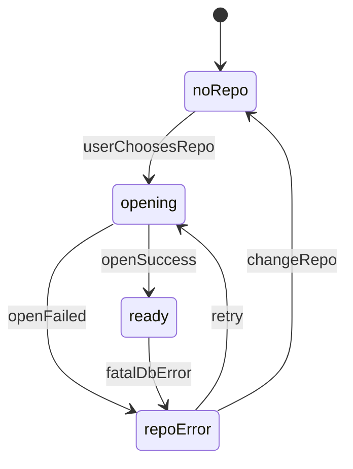

# 主界面三件套状态机（Tree / List / Detail）

> 定义 AreaMatrix 主界面的三大区域：侧边栏树（Tree view）、文件列表（List）、详情面板（Detail）的完整状态机与交互契约。覆盖空态、加载态、正常态、选中态、多选态、错误态、锁定态，以及键盘焦点与可访问性约束。
>
> 阅读时长：约 20 分钟。

---

## 目标与成功标准

### 目标

1. **状态可预测**：用户在任何时刻都知道“我现在看的是哪个范围、为什么看不到文件、下一步能做什么”。\n
2. **跨模块一致**：Tree 选中、List 选中、Detail 展示之间不打架，避免“选中错位”。\n
3. **快与稳**：加载/同步/导入过程中 UI 不抖动、不闪烁；大库也能渐进渲染。\n
4. **键盘友好**：不依赖鼠标即可完成核心操作（选中、预览、删除、改分类）。\n
5. **错误不阻断**：单条错误不导致全 UI 失效；错误必须可恢复。\n

### 成功标准（验收）

- **UIM1**：无 repo / 未配置时，主界面不出现，必走首次启动向导（见 `first-launch.md`）。\n
- **UIM2**：repo 已打开但无文件时：Tree 有分类节点，List 显示空态引导“拖入文件”。\n
- **UIM3**：导入进行中：List 可见“导入中”条目或顶部进度条；仍可浏览其他分类。\n
- **UIM4**：外部修改（FSEvents）回流：List 中对应条目稳定更新，不丢选中。\n
- **UIM5**：DB 锁/损坏：UI 显示错误态并提供“重试/导出诊断/重建索引（若支持）”。\n

---

## 术语与对象模型（UI 侧）

### UI 区域

- Tree：侧边栏树状视图（分类/目录）\n
- List：文件列表（当前 Tree 选中的节点范围）\n
- Detail：详情面板（当前 List 选中的文件或多选摘要）\n

### 关键状态

- repoState：未选择/打开中/已打开/错误\n
- treeSelection：当前选中节点（category 或 path node）\n
- listSelection：当前选中条目（单选/多选/空）\n
- detailTab：元数据/改动/笔记\n
- operationState：导入中/扫描中/空闲\n

---

## 全局状态机（Repo 级）



说明：\n
- `noRepo`：不渲染主界面，展示向导/选择 repo。\n
- `opening`：展示全屏 loading（避免局部 UI 半成品）。\n
- `ready`：主界面三件套激活。\n
- `repoError`：全屏错误页，提供恢复动作。\n

---

## 主界面布局（ASCII）

```
┌──────────────────────────────────────────────────────────────────────────────┐
│ Toolbar: [RepoName ▾] [Search ⌘F] [Import…] [Settings] [Progress]             │
├───────────────┬───────────────────────────────────────────────┬──────────────┤
│ Tree          │ List                                          │ Detail       │
│ (sidebar)     │ (table)                                       │ (tabs)       │
│               │                                               │              │
│ docs          │  Name      Category   Size   Imported          │ [Meta][Log]  │
│ code          │  ...                                           │ [Note]       │
│ design        │                                               │              │
│ inbox         │                                               │              │
└───────────────┴───────────────────────────────────────────────┴──────────────┘
```

---

## Tree（侧边栏）状态机

### Tree 的 6 种状态

| 状态 | 触发条件 | UI 行为 | 可操作 |
|---|---|---|---|
| treeEmpty | repo 初始化但无分类（理论不应发生） | 显示“初始化中/缺少分类” | 重试 |
| treeLoading | 首次构建树 / rescan | 显示 skeleton + 保留上一次树（若有） | 允许切换已加载节点 |
| treeReady | 树构建完成 | 正常显示 | 选中节点/右键菜单 |
| treeSelected | 有选中节点 | 高亮选中 | 拖拽目标/导航 |
| treeError | 构建树失败（walkdir/DB） | 显示错误 banner | 重试/诊断 |
| treeLocked | repo 正在迁移/恢复 | 禁止交互，显示锁 | 仅查看 |

### Tree 选中规则

1. 启动后默认选中 `inbox`（新用户最友好）\n
2. 若用户上次退出时有 selection，恢复该 selection（若仍存在）\n
3. selection 不存在（目录被删）：回退到 `inbox` 并提示一次\n

### Tree 的拖拽行为

作为 drop target：\n
- drag item 悬停在某分类节点上 → 节点高亮\n
- drop 到节点 → 目标分类 = 该节点（覆盖 classifier 推荐）\n

（与 `drag-import-flow.md` 对齐）

---

## List（文件列表）状态机

### List 的 6 种状态

| 状态 | 触发条件 | UI 行为 | 可操作 |
|---|---|---|---|
| listEmpty | 当前 selection 下无文件 | 空态引导（拖拽/导入按钮） | 导入 |
| listLoading | 切换分类/加载分页 | skeleton + 保留旧列表（可选） | 可中断切换 |
| listReady | 有数据且加载完成 | 表格展示 | 排序/筛选 |
| listSelected | 单选或多选 | 高亮行 | 详情面板更新 |
| listError | 查询失败（DB 锁/IO） | inline error + 重试 | 重试/诊断 |
| listLocked | 导入/迁移导致不可写 | 表格可读但禁用写操作 | 仅查看 |

### 空态（listEmpty）规范

空态必须给“下一步”：\n
- 主按钮：`Import…`\n
- 次按钮：`Drag files here`\n
- 说明：当前分类名 + 该分类用途（从 classifier.yaml 显示名/描述中取）\n

```
┌──────────────────────────────────────────────────────────────────────────────┐
│ docs                                                                            │
│                                                                                │
│  这里还没有文件。                                                               │
│  把 PDF / 文档拖到这里，AreaMatrix 会自动分类并更新概览。                       │
│                                                                                │
│  [ Import… ]                                                                    │
└──────────────────────────────────────────────────────────────────────────────┘
```

### 排序与选择保持

#### 排序

默认排序建议：`imported_at desc`（最符合“找最近导入”场景）。\n
可选：name/size/modified_at。\n

#### 选择保持（关键）

当外部事件或导入导致 list 刷新时：\n
- 如果选中的 fileId 仍存在：保持选中\n
- 若已删除：清空选中并在 Detail 显示“该文件已删除/移动”提示\n
- 若重命名：保持选中（靠 fileId）并平滑更新行内容\n

---

## Detail（详情面板）状态机

### Detail 的 6 种状态

| 状态 | 触发条件 | UI 行为 | 可操作 |
|---|---|---|---|
| detailEmpty | listSelection 为空 | 显示提示“选择一个文件查看详情” | 无 |
| detailLoading | 切换选中、加载笔记/日志 | 显示 spinner + 保留上一次（可选） | 可切换 tab |
| detailReady | 单选 | 展示 Meta/Log/Note tabs | 编辑笔记/操作 |
| detailMulti | 多选 | 显示多选摘要 + 批量操作入口 | 批量改分类/删除 |
| detailError | 加载失败 | inline error + 重试 | 重试/诊断 |
| detailLocked | 文件缺失/只读 | 禁用编辑按钮 | 仅查看 |

### Tab 约定

| Tab | 内容 | 默认进入 |
|---|---|---|
| Meta | 元数据（分类、路径、hash 前缀、大小、导入时间） | 默认 |
| Log | 改动时间线（change_log） | 若刚导入/刚发生外部修改，可自动切到此 Tab（一次性） |
| Note | 伴生笔记（.md） | 用户手动选择 |

---

## 三件套之间的联动契约

### 联动规则（简表）

| 动作 | Tree | List | Detail |
|---|---|---|---|
| 选中 Tree 节点 | selection 更新 | 触发 listLoading → listReady | detailEmpty（清空） |
| 单击 List 行 | 不变 | listSelected | detailLoading → detailReady |
| 多选 List 行 | 不变 | listSelected(multi) | detailMulti |
| 导入到当前分类 | 不变 | 插入新行并高亮 | 自动切到新行的 Meta |
| 外部重命名 | 若路径仍在同分类，不变 | 行文本更新 | 若选中，Meta 更新 |
| 外部移动到其他分类 | 可能影响计数 | 从当前列表移除 | 若选中，显示“已移动”并提供“跳转到新位置” |

### “跳转到新位置”规范

当选中文件在外部移动后：\n
- Detail 显示 banner：`该文件已移动到 <category/path> [Go to]`\n
- 点击 Go to：Tree 选中目标节点，List 高亮该文件\n

---

## 关键错误态设计（不阻断）

### DB locked（常见）

List 的错误不应把 Tree 变灰：\n
- Tree 仍可切换节点\n
- List 显示 inline 错误卡 + Retry\n

```
┌──────────────────────────────────────────────────────────────────────────────┐
│ 无法加载列表                                                                    │
│ 数据库被占用（database is locked）。可能同时打开了两个 AreaMatrix 实例。          │
│ [ Retry ]   [ Collect diagnostics… ]                                           │
└──────────────────────────────────────────────────────────────────────────────┘
```

### 文件缺失（Index-only / 外部删除）

Detail 显示“缺失”状态：\n
- Meta：显示源路径\n
- 操作：`Locate…`（让用户重新定位） / `Remove from index`\n

---

## 键盘与焦点（可访问性）

### 焦点模型

- Tree / List / Detail 三个区域都可获得焦点。\n
- `Tab` 在三个区域间循环。\n
- `↑↓` 在当前区域内移动。\n
- `Enter`：在 Tree 选中节点、在 List 打开/预览（可选）。\n
- `Space`：快速预览（Stage 2 可选）。\n

### 建议快捷键

| 快捷键 | 动作 |
|---|---|
| ⌘F | 聚焦搜索栏 |
| ⌘I | 打开 Import…（等价菜单 File→Import） |
| ⌫ / Delete | 删除（走回收站，需确认） |
| ⌘⌫ | 永久删除（默认不提供，Stage 2 可选） |
| ⌘L | 聚焦 List |
| ⌘1/⌘2/⌘3 | 切换 Detail Tab（Meta/Log/Note） |

---

## 性能与渐进加载（产品侧约束）

### 大库策略（10 万文件）

产品侧可接受：\n
- Tree 先渲染分类节点，再渐进渲染子目录（若支持）\n
- List 分页/虚拟化（滚动到末尾加载）\n
- Detail 的 Log/Note 懒加载（切 Tab 才加载）\n

### “保持稳定”原则

任何后台刷新（FSEvents/同步）都必须：\n
- 不清空用户正在看的列表\n
- 不抢焦点\n
- 只做局部更新（行更新/计数更新）\n

---

## 测试用例（产品验收清单）

- [ ] repo ready：默认选中 inbox，List 空态可导入\n
- [ ] 切换 Tree 节点：List skeleton，加载完展示\n
- [ ] 外部重命名：List 行更新且保持选中\n
- [ ] 外部移动：Detail 出现“已移动”banner，可 Go to\n
- [ ] DB locked：List error 可重试，Tree 仍可切换\n
- [ ] 多选：Detail 进入 multi 摘要\n
- [ ] 键盘：Tab 循环区域，⌘F 聚焦搜索\n

---

## Related

- [drag-import-flow.md](drag-import-flow.md)
- [../modules/tree-scan.md](../modules/tree-scan.md)
- [../modules/change-log.md](../modules/change-log.md)
- [../architecture/fs-watcher.md](../architecture/fs-watcher.md)
- [../architecture/source-of-truth.md](../architecture/source-of-truth.md)
- [../api/error-codes.md](../api/error-codes.md)

---

## 附录 A：三件套状态矩阵（快速查表）

| 场景 | Tree | List | Detail |
|---|---|---|---|
| 新 repo（无文件） | Ready + inbox selected | Empty state + Import CTA | Empty（提示选择文件） |
| 导入中（当前分类） | Ready | Ready + 顶部进度条/插入行 | 若选中新行：Meta |
| 外部改名 | Ready | Row update（保持 fileId selection） | 若选中：Meta 更新 |
| 外部移动到别的分类 | Ready | Row removed | Banner + Go to |
| DB locked | Ready | Error inline + Retry | 若已有选中可保留旧详情（可选） |
| 多选 | Ready | Multi selected | Multi summary + batch actions |

---

## 附录 B：Detail Multi 视图建议（ASCII）

```
┌──────────────────────────────────────────────────────────────────────────────┐
│ 已选择 12 个文件                                                               │
│                                                                              │
│  批量操作：                                                                    │
│   [ Change category… ]  [ Add tag… ]  [ Delete… ]                              │
│                                                                              │
│  提示：批量删除默认移到回收站，可在设置中改为“仅从索引移除”。                   │
└──────────────────────────────────────────────────────────────────────────────┘
```
