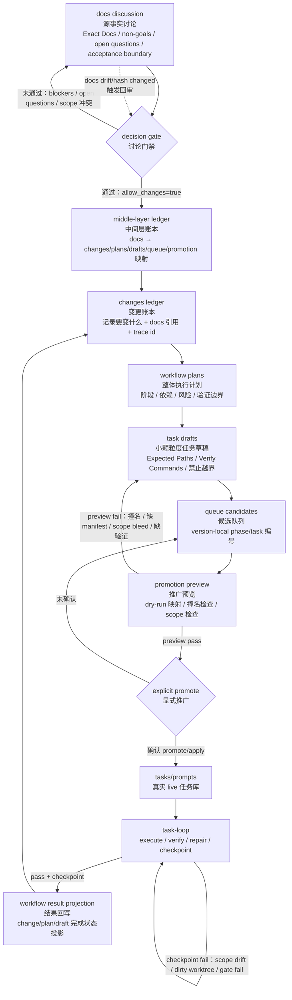

# AreaMatrix 工作流优化需求汇总 → AreaFlow 产品规划

> **文档性质**：工作流优化需求收集 + 讨论结论 + 完整产品愿景
> **创建时间**：2026-05
> **讨论日期**：2026-05-24 / 2026-05-25
> **状态**：需求已确认，AreaFlow 已升级为 AI 开发项目管理平台；等 AreaMatrix MVP 完成后启动

---

## 目录

- [1. 核心流水线](#1-核心流水线)
- [2. task-loop 执行引擎](#2-task-loop-执行引擎)
- [3. 可观测性与通知](#3-可观测性与通知)
- [4. 容错与恢复](#4-容错与恢复)
- [5. 智能修复与记忆](#5-智能修复与记忆)
- [6. 日志与审计](#6-日志与审计)
- [7. 产品功能想法](#7-产品功能想法)
- [8. 事故复盘](#8-事故复盘)
- [9. 讨论结论：AreaFlow 独立产品](#9-讨论结论areaflow-独立产品)
- [附录 A：流水线架构图](#附录-a流水线架构图)
- [附录 B：总控脚本架构](#附录-b总控脚本架构)
- [附录 C：AreaFlow 分层架构（最终版）](#附录-careaflow-分层架构最终版)
- [附录 D：AreaFlow 引擎配置示例](#附录-dareaflow-引擎配置示例)
- [附录 E：完整 areaflow.yaml schema](#附录-e完整-areaflow-yaml-schema)

---

## 1. 核心流水线

### 1.1 端到端流程

整套流程由 **docs 源事实** 驱动，经过多层账本和门禁，最终交付到 task-loop 自动执行：

```
docs 讨论 → middle-layer 账本 → changes 账本 → plans 整体提示词
→ drafts 小颗粒度提示词 → queue candidate → promotion preview
→ tasks/prompts → task-loop 执行验收闭环
```

### 1.2 各环节说明

| 环节 | 职责 | 关键约束 |
|------|------|----------|
| **docs 讨论** | 源事实讨论；明确 non-goals、open questions、验收边界 | 讨论门禁未通过前不生成任何下游产物 |
| **middle-layer 账本** | 记录 docs → changes/plans/drafts/queue/promotion 的映射关系 | 每条变更可追溯到 docs 原文 |
| **changes 账本** | 记录"要变什么"：插入哪个文件、哪些行、关联功能有哪些 | 带 trace id，双向可查 |
| **plans 整体提示词** | 按依赖排序的执行计划（如 B 功能 → A 功能优化） | 必须包含阶段、依赖、风险、验证边界 |
| **drafts 小颗粒度提示词** | 精细化拆分，防止上下文过大导致幻觉 | 包含 Expected Paths、Verify Commands、禁止越界声明 |
| **queue candidate** | 版本化的候选队列（phase/task 编号） | — |
| **promotion preview** | dry-run 映射、撞名检查、scope 检查 | preview fail 退回 drafts 修正 |
| **tasks/prompts** | 真实 live 任务库（显式确认后才写入） | — |
| **task-loop** | execute → verify → repair → checkpoint 闭环 | verify fail 在当前会话内修复 |

### 1.3 前端任务的特殊路径

> 工作流在完成前端任务或通过 image2 生成出前端图片后，通过图片进行解析成提示词，然后通过提示词完成实现。

```
前端设计稿 / image2 生成 → 图片解析为提示词 → drafts → 正常流水线
```

---

## 2. task-loop 执行引擎

### 2.1 优雅停止（Graceful Stop）

**场景**：正在执行第 30 个任务时需要关机或额度即将耗尽。

**期望行为**：
1. 通过 `./dev` 控制台发出停止信号
2. 跑完当前正在执行的任务
3. 完成收尾：提交 Git、保存当前进度
4. 安全退出

**触发方式**：`./dev` 控制台命令（中途可操控）

### 2.2 恢复执行（Resume Stale）

**命令**：`./dev resume-stale`

**场景**：中断后继续执行，需要解决以下问题——

- 中断后再继续时，summary.json 中应保留完整信息（git_branch、git_changed_files、git_checkpoint_status、git_commit 等）
- 手动推送时缺少自动记录的元数据，导致审计信息不完整

**完整记录示例**（期望）：

```json
{
  "attempts": 2,
  "copy_log": "...copy-attempt-2.log",
  "git_branch": "codex/areamatrix-task-loop-...",
  "git_changed_files": ["file1.swift", "file2.swift"],
  "git_checkpoint_status": "committed",
  "git_commit": "a40fb38...",
  "status": "completed"
}
```

**不完整记录示例**（手动推送时的现状）：

```json
{
  "attempts": 1,
  "copy_log": "...copy-attempt-1.log",
  "status": "completed"
  // ← 缺少 git_branch、git_changed_files、git_commit 等
}
```

### 2.3 环境重置

> **Backlog**：留待 AreaFlow MS-5（完整流水线）时讨论，当前 AreaMatrix task-loop 不涉及环境重置。

> 每次测试是否都需要把环境归位到最初始状态？

需要明确：哪些环境状态需要重置、哪些可以增量保留。

### 2.4 资源分配

> **Backlog**：留待 AreaFlow MS-5（完整流水线）时讨论，受限于 Codex CLI 并发能力。

> 脚本执行感觉很慢，能否多分配资源加速？

待讨论：并行度、Codex 并发会话数、本机资源限制等。

### 2.5 脚本内模型切换

> **已被覆盖**：此需求已由 [9.2 AI 引擎方向](#92-ai-引擎方向) 和 [9.3 交互形态](#93-交互形态) 中的多引擎 fallback + `areaflow.yaml` 引擎配置方案覆盖。

> 脚本中能否通过 `/model` 类似形式动态切换模型？

---

## 3. 可观测性与通知

### 3.1 执行进度可视化

| 需求 | 说明 |
|------|------|
| `./dev check all` 进度展示 | 能看到具体执行了什么，而非黑盒 |
| 页面内进度小窗口 | 在页面有一个小窗口可以看实时进度 |
| 图形化监控面板 | 添加图形化界面进行更好的观看 |

### 3.2 通知机制

| 通知方式 | 触发时机 |
|----------|----------|
| **系统通知** | 任务完成后调用 macOS 系统通知 |
| **邮件通知** | 每完成一个任务发送一次（完成 / 检验未通过 / 通过） |
| **进度同步邮件** | 中途卡住（如 model capacity 错误）时同步发送当前进度 |

### 3.3 时间与调用日志

> 每次执行应该记录：当前时间、执行了多久、调用了多少次 API。

```
[2026-05-13 17:17:39] task-13 copy attempt=1
  duration: 3m 42s | api_calls: 27 | tokens: 429,481 | status: FAIL
```

---

## 4. 容错与恢复

### 4.1 模型容量错误自动重启

**现状问题**：遇到 `ERROR: Selected model is at capacity` 后整个对话直接终止，没有任何重试。

**期望行为**：
1. 检测到 capacity 错误
2. 等待一段时间后自动重启
3. 从中断点继续执行
4. 邮件同步发送当前进度

### 4.2 验证失败的处理策略

**原则**：谁提出问题，谁解决。

**期望流程**：
1. verify 失败 → 在当前验收会话中完成修复
2. 只验收本次修复的内容
3. 单项验收通过 → 再进入整体总验收

### 4.3 Agent ID 追踪

> 引入唯一 Agent ID 概念，方便搜索和追踪。

每次执行会话绑定唯一 ID，日志、Git 提交、通知中统一引用。

---

## 5. 智能修复与记忆

### 5.1 重复修复识别

**现状问题**：检验第一次出现某问题 → 修复 → 仍未修好 → 再次检验 → 同类问题重复出现 → 循环。

**期望行为**：

```
┌─ 第 1 次 verify fail ─────────────────────────────┐
│  记录：问题是什么、原因是什么、修复方案是什么          │
└───────────────────────────────────────────────────┘
         │
         ▼
┌─ 修复后检查 ──────────────────────────────────────┐
│  1. 该问题的依赖是否都已解决？                       │
│  2. 修复方案与上次是否不同？（避免重复尝试同一方案）    │
│  3. 关联功能是否同步更新？                           │
│  → 全部确认后才进入下一次 verify                     │
└───────────────────────────────────────────────────┘
```

### 5.2 问题记录文档

> 出了问题后记录到记录文档中，每当执行完一个大的 phase 后进行：
> - 优化提示词
> - 优化 skill
> - 优化项目

### 5.3 功能与代码索引

> 把全部功能和详细功能都列出来，存入记忆中，包括相关的文件代码、如何区分的。

---

## 6. 日志与审计

### 6.1 日志归属

> v1 的日志就应该在 v1 的工作流目录中，而非统一放在 `.codex/` 中。

**原则**：日志跟随版本和工作流，就近存放。

### 6.2 GitHub CI 测试

> **Backlog**：CI 环境问题与 AreaFlow 产品无关，属于 AreaMatrix 项目本身的运维事项，单独处理。

> 为什么在 GitHub 中的测试有很多是失败的？

需要排查 CI 环境与本地环境的差异。

---

## 7. 产品功能想法

### 7.1 Mac 上的"Windows OneDrive"体验

**目标**：在 Mac 上实现类似 Windows OneDrive 的"秒开所有深层文件夹 + 云朵图标"体验。

| 模块 | 职责 |
|------|------|
| **后台管家** | 在后台把云端所有文件/文件夹的名字和属性抄写在本地记事本（不下载真实文件） |
| **极速浏览界面** | 双击文件夹时直接查本地"记事本"，瞬间列出所有带云朵图标的文件 |
| **按需加载** | 只有双击打开或空格预览时才下载真实文件；完美支持 Mac 快捷预览和拖拽 |

**已知妥协**：这套体验只存在于 AreaMatrix 应用内部。其他应用的"打开文件"对话框仍受限于 macOS 原生行为。

### 7.2 AppleScript / UI 自动化测试

> **已被覆盖**：此需求已纳入 [9.5 全部 31 项功能全景](#95-全部-31-项功能全景) 中的 #21（UI 自动化引擎），归属 M3 Pluggable Engine，排期 MS-6。

> Codex exec 能否执行 AppleScript 和 Swift CGEvent 来操控 UI？

```applescript
tell application "System Events"
  tell process "AreaMatrix"
    set frontmost to true
    set position of window 1 to {60, 50}
    set size of window 1 to {1500, 980}
  end tell
end tell
```

```swift
// CGEvent 滚动模拟（示例）
let source = CGEventSource(stateID: .hidSystemState)
let point = CGPoint(x: 900, y: 610)
CGEvent(mouseEventSource: source, mouseType: .mouseMoved,
        mouseCursorPosition: point, mouseButton: .left)?
    .post(tap: .cghidEventTap)
```

**问题**：Codex CLI 是否支持这类需要 GUI 权限的操作？

---

## 8. 事故复盘

### 8.1 task-loop 无限 retry 事故

| 字段 | 内容 |
|------|------|
| **定级** | P1 / Sev-2，高严重度自动化执行事故 |
| **事故名称** | task-loop 对非代码环境阻塞缺少分流，导致同一 Xcode 问题无限 repair retry |
| **直接原因** | `./dev check all` 失败点是本机 Xcode / CoreSimulator 版本不一致（IDESimulatorFoundation 插件加载失败、DVTDownloads symbol 缺失），这是**外部工具链环境问题**，不是业务代码问题 |
| **根因** | runner 策略只有一条路：`verify FAIL → 认为 task 未修好 → copy repair retry → 再 verify`，没有区分失败类型 |
| **影响** | task-loop 空转一整晚、重复执行 20 轮、污染进度状态 |

**缺少的分流机制**：

```
verify FAIL
  ├─ [A] 可通过改代码修复的问题     → repair retry
  ├─ [B] 必须修宿主环境的问题       → 标记 blocked，通知用户
  ├─ [C] Git / checkpoint / 权限问题 → 标记 blocked，通知用户
  └─ [D] 重复失败指纹（runaway loop）→ 熔断，停止 retry
```

**事故结论**：这是自动化控制逻辑事故，不是业务代码事故。下一步应该修 runner，而不是继续要求 Codex 更努力地改项目。

---

## 9. 讨论结论：AreaFlow 独立产品

> 2026-05-24 讨论确认：将当前工作流系统独立为通用产品 **AreaFlow**。

### 9.1 核心决策

| 决策项 | 结论 |
|--------|------|
| **产品名称** | AreaFlow |
| **定位** | AI 开发项目管理平台（看板 + 多项目 + 多代理 + 模板市场） |
| **独立性** | 独立仓库，AreaMatrix 通过配置文件接入 |
| **适用范围** | macOS 桌面、小程序、Android、Windows 桌面等任意项目类型 |
| **启动时间** | AreaMatrix MVP 完成后立即启动 |
| **首个用户** | AreaMatrix 项目本身（dogfooding） |
| **与 AreaMatrix 关系** | AreaMatrix 的 `scripts/task_loop/`、`scripts/dev_tools/`、`workflow/` 是原型代码 |

### 9.2 AI 引擎方向

不绑定单一供应商，采用**可插拔引擎 + 用户可配置优先级和 fallback**：

- 支持直接调 API（OpenAI、Anthropic、Google 等）
- 支持委托给本地 CLI 工具（Codex CLI、Claude Code CLI、Cursor Agent SDK 等）
- 引擎优先级和 fallback 顺序由用户在 `areaflow.yaml` 中配置
- 当 engine-1 遇到 capacity error → 自动 fallback 到 engine-2 → 通知用户

### 9.3 交互形态

CLI + Web Dashboard + macOS Menu Bar，逐步建设：

| 形态 | 优先级 | 说明 |
|------|--------|------|
| **CLI**（`areaflow run` / `areaflow status`） | MS-1 | 核心交互方式 |
| **Web Dashboard / 看板** | MS-6 | Web App + Desktop App（Tauri） |
| **macOS Menu Bar** | MS-6 | 常驻菜单栏，点击展开看进度 |

### 9.4 ~~技术栈方向（已过时）~~

> **已过时**：此节为初始讨论记录，技术栈已在 2026-05-25 重新选型。权威版本见 [9.16 技术栈（最终版）](#916-技术栈最终版2026-05-25-技术选型讨论后更新)。
>
> 核心变化：Python → **Go**（并发编排 + 单二进制分发 + CLI-first）。

### 9.5 全部 31 项功能全景

> 权威功能清单。#1-22 来自初始需求，#23-26 来自缺口分析（9.7），#27-31 来自产品定位升级（9.14）。

| # | 功能 | 归属模块 | 里程碑 | 来源 |
|---|------|----------|--------|------|
| 1 | 优雅停止 | M2 Agent Runner | MS-1 | 初始 |
| 2 | 恢复执行 | M2 Agent Runner | MS-1 | 初始 |
| 3 | 环境重置 | M2 Agent Runner | MS-5 | 初始 |
| 4 | 资源分配 | M2 Agent Runner | MS-5 | 初始 |
| 5 | 模型切换 | M3 Pluggable Engine | MS-2 | 初始 |
| 6 | 多引擎 fallback | M3 Pluggable Engine | MS-2 | 初始 |
| 7 | 验证失败分流 | M4 Fault Tolerance | MS-2 | 初始 |
| 8 | Agent ID 追踪 | M4 Fault Tolerance | MS-1 | 初始 |
| 9 | 进度展示 | M5 Observability | MS-3 | 初始 |
| 10 | macOS 系统通知 | M6 Notification | MS-3 | 初始 |
| 11 | 邮件通知 | M6 Notification | MS-3 | 初始 |
| 12 | 时间日志 | M5 Observability | MS-3 | 初始 |
| 13 | 重复修复识别 | M4 Fault Tolerance | MS-2 | 初始 |
| 14 | Phase 后复盘 | M7 Intelligence | MS-6 | 初始 |
| 15 | 功能与代码索引 | M7 Intelligence | MS-6 | 初始 |
| 16 | 日志归属 | M5 Observability | MS-3 | 初始 |
| 17 | CI 对齐 | M5 Observability | MS-3 | 初始 |
| 18 | Web 进度面板 | M8 Dashboard | MS-6 | 初始 |
| 19 | 图形化监控 | M8 Dashboard | MS-6 | 初始 |
| 20 | ~~Mac "OneDrive" 秒开~~ | — | — | *留在 AreaMatrix* |
| 21 | UI 自动化引擎 | M3 Pluggable Engine | MS-6 | 初始 |
| 22 | 前端图片→提示词 | M1 Pipeline | MS-5 | 初始 |
| 23 | 执行 Harness 抽象 | M2 Agent Runner | MS-1 | 缺口分析 |
| 24 | 失败归因 Skill | M4 Fault Tolerance | MS-2 | 缺口分析 |
| 25 | 跨项目隔离 | M1 Pipeline | MS-4 | 缺口分析 |
| 26 | 引擎接入门禁 | M3 Pluggable Engine | MS-2 | 缺口分析 |
| 27 | 多项目连接 | M9 Platform | MS-4 | 产品升级 |
| 28 | 引擎资源池 | M10 Scheduler | MS-4 | 产品升级 |
| 29 | 看板 UI | M8 Dashboard | MS-6 | 产品升级 |
| 30 | 跨项目调度 | M10 Scheduler | MS-4 | 产品升级 |
| 31 | 全局统计面板 | M9 Platform | MS-6 | 产品升级 |

**模块汇总**（10 个）：

| 模块 | 功能数 | 说明 |
|------|--------|------|
| M1 Pipeline Orchestrator | 3 | #22、#25、Pipeline 全链路 |
| M2 Agent Runner | 5 | #1、#2、#3、#4、#23 |
| M3 Pluggable Engine | 4 | #5、#6、#21、#26 |
| M4 Fault Tolerance | 4 | #7、#8、#13、#24 |
| M5 Observability | 4 | #9、#12、#16、#17 |
| M6 Notification | 2 | #10、#11 |
| M7 Intelligence | 2 | #14、#15 |
| M8 Dashboard | 3 | #18、#19、#29 |
| M9 Platform | 2 | #27、#31 |
| M10 Scheduler | 2 | #28、#30 |

### 9.6 ~~v0.1 内部里程碑（已过时）~~

> **已过时**：此节为产品定位升级前的 5 阶段版本。权威版本见 [9.15 v0.1 里程碑（最终版，6 个阶段）](#915-v01-里程碑最终版6-个阶段)。
>
> 核心变化：新增 MS-4（多项目 + 多代理）、原 MS-4/MS-5 后移为 MS-5/MS-6。

### 9.7 补充需求（缺口分析后新增）

> 2026-05-25 追加：基于现有 skills、governance 和执行框架的缺口分析。

#### 新增需求（#23 ~ #26）

| # | 需求 | 说明 | 归属模块 | 里程碑 |
|---|------|------|----------|--------|
| 23 | **执行 Harness 抽象** | 把 runner.py 的执行/解析/超时/sandbox 逻辑抽象为通用 harness；当前紧耦合 `codex exec` | M2 Agent Runner | MS-1 |
| 24 | **失败归因 Skill** | 当前只有 debugging runbook，没有自动化的失败分类。需要：代码/环境/权限/runaway 四类分流 + 失败指纹匹配 + 熔断阈值 | M4 Fault Tolerance | MS-2 |
| 25 | **跨项目隔离** | AreaFlow 服务多项目时的配置/日志/进度隔离，项目间互不干扰 | M1 Pipeline | MS-4 |
| 26 | **引擎接入门禁** | 新 AI 引擎接入时的能力声明（file_edit / GUI / context_tokens）、安全评估、fallback 配置规范 | M3 Pluggable Engine | MS-2 |

#### Harness 架构（#23 详细设计）

当前（紧耦合）：

```
runner.py → 直接调 codex exec → 直接解析输出 → 直接写 progress.json
```

期望（解耦）：

```
Runner
├─ Engine Harness（执行框架）
│   ├─ 统一的 prompt 注入格式
│   ├─ 统一的输出解析（VERIFY_RESULT: PASS/FAIL）
│   ├─ 超时 / watchdog / 无输出检测
│   ├─ sandbox 配置（读写权限、网络、GUI）
│   └─ 资源监控（token、API 调用、耗时）
│
├─ Engine Adapter（引擎适配）
│   ├─ CodexCLIAdapter
│   ├─ ClaudeCodeAdapter
│   ├─ OpenAIAPIAdapter
│   └─ CursorSDKAdapter
│
└─ Fault Harness（容错框架）
    ├─ 失败分类器
    ├─ 重复指纹检测
    ├─ 熔断器
    └─ fallback 路由
```

#### AreaFlow 内置 Skill 体系

AreaFlow 的 Skill 不是硬编码的，而是一个**可选择、可组合的内置库**。用户根据自己项目的技术栈，在 `areaflow.yaml` 中声明需要的 Skill，AreaFlow 据此激活对应的验证命令、编码规范、文件安全规则、构建流程等。

**配置示例**：

```yaml
# areaflow.yaml — 项目级 Skill 选择
project:
  name: AreaMatrix
  tech_stack: [rust, swift, uniffi]

skills:
  # 平台 Skill（按技术栈选择）
  platform:
    - rust-core          # cargo fmt / clippy / test
    - swift-macos        # xcodebuild / SwiftFormat / SwiftLint / XCTest
    - uniffi-bridge      # UDL → Swift binding 同步检查

  # 通用 Skill（所有项目可用）
  universal:
    - git-checkpoint     # PASS 后自动 commit
    - file-safety        # 用户文件不可被覆盖/删除
    - doc-sync           # 文档与代码一致性
    - validation-driver  # 按变更路径选最小验证集

  # 可选 Skill
  optional:
    - enterprise-governance  # CODE_REVIEW / SECURITY / CI
    - workflow-planning      # 版本规划生命周期
```

**另一个项目的配置**：

```yaml
# areaflow.yaml — 微信小程序项目
project:
  name: my-miniprogram
  tech_stack: [wechat-miniprogram, typescript]

skills:
  platform:
    - wechat-miniprogram  # 小程序编译 / 预览 / 体验版上传
    - typescript           # tsc / eslint / prettier
  universal:
    - git-checkpoint
    - file-safety
    - validation-driver
```

**Skill 分层**：

| 层级 | 说明 | 来源 |
|------|------|------|
| **平台 Skill** | 与技术栈绑定的验证/构建/规范 | AreaFlow 内置，按 `tech_stack` 激活 |
| **通用 Skill** | 所有项目都可用的通用能力 | AreaFlow 内置，默认推荐 |
| **可选 Skill** | 按需开启的增强能力 | AreaFlow 内置，用户选择 |
| **自定义 Skill** | 用户为自己项目写的专属 Skill | 项目仓库内，用户编写 |

**内置平台 Skill 清单（v0.1 规划）**：

| Skill ID | 技术栈 | 提供能力 |
|----------|--------|----------|
| `rust-core` | Rust | `cargo fmt --check` / `cargo clippy` / `cargo test` / Rust 编码规范 |
| `swift-macos` | Swift + macOS | `xcodebuild` / SwiftFormat / SwiftLint / XCTest |
| `swift-ios` | Swift + iOS | 同上 + iOS 模拟器 / 签名检查 |
| `uniffi-bridge` | UniFFI | UDL → 绑定同步 / 跨语言类型检查 |
| `typescript` | TypeScript | `tsc` / `eslint` / `prettier` / Jest |
| `react-native` | React Native | Metro bundler / Detox E2E / 平台构建 |
| `wechat-miniprogram` | 微信小程序 | 小程序 CLI 编译 / 预览 / 体验版 / WXML 规范 |
| `android-kotlin` | Android + Kotlin | `gradlew` / ktlint / Android Lint / Espresso |
| `python-cli` | Python | `ruff` / `mypy` / `pytest` |
| `flutter` | Flutter + Dart | `flutter analyze` / `flutter test` / Dart 规范 |
| `electron` | Electron | `electron-builder` / Spectron / Node 安全审计 |
| `windows-dotnet` | Windows + .NET | `dotnet build` / `dotnet test` / StyleCop |

**每个 Skill 提供什么**：

```yaml
# 示例：rust-core skill 的内部定义
id: rust-core
name: Rust Core
tech_stack: rust
provides:
  validation_commands:
    fmt:     "cargo fmt --all -- --check"
    lint:    "cargo clippy --all-targets --all-features -- -D warnings"
    test:    "cargo test --workspace"
  coding_standards: "rust-core/coding-standards.md"
  file_patterns:
    source:  ["**/*.rs", "**/Cargo.toml"]
    test:    ["**/tests/**/*.rs"]
    config:  ["Cargo.toml", "Cargo.lock", "rust-toolchain.toml"]
  risk_boundaries:
    high:    ["**/migrations/**", "**/schema.rs"]
    mission_critical: ["**/user_data/**"]
  build_commands:
    debug:   "cargo build"
    release: "cargo build --release"
```

**Skill 发现与加载流程**：

```
1. AreaFlow 启动，读取 areaflow.yaml
2. 解析 tech_stack 和 skills 配置
3. 从内置 Skill 库匹配并加载
4. 合并项目仓库内的自定义 Skill
5. 注册到 Validation Engine、Build Engine、Coding Standards 等子系统
6. Runner 执行时，按 Skill 提供的命令进行验证/构建
```

#### 系统级 Skill（非技术栈相关）

除了平台 Skill，AreaFlow 还内置以下系统级 Skill：

| Skill ID | 说明 | 对应模块 |
|----------|------|----------|
| `failure-triage` | 失败分类规则、失败指纹匹配、熔断阈值 | M4 Fault Tolerance |
| `engine-orchestrator` | 引擎注册表、fallback 路由、capacity error 检测 | M3 Pluggable Engine |
| `notification-dispatch` | 系统通知触发条件、邮件模板、进度同步策略 | M6 Notification |
| `progress-reporter` | 阶段性输出格式、时间/token 统计、日志归属 | M5 Observability |
| `repair-memory` | 失败原因记录、历史修复查询、重复方案检测 | M7 Intelligence |
| `pipeline-orchestrator` | docs → closeout 全链路编排规则 | M1 Pipeline |

#### 新增 Governance 建议（G1 ~ G2）

| # | 文档 | 覆盖缺口 |
|---|------|----------|
| G1 | **engine-admission.md** | 新引擎接入门禁：能力声明、安全评估、fallback 配置规范（类似 `external-capability-admission.md` 的引擎版） |
| G2 | **cross-project-boundary.md** | 多项目隔离规则：配置/日志/进度互不干扰、共享 vs 独立配置边界 |

#### 里程碑映射

> 功能→里程碑的完整映射已整合到 [9.5 全部 31 项功能全景](#95-全部-31-项功能全景) 的里程碑列，以及 [9.15 v0.1 里程碑（最终版）](#915-v01-里程碑最终版6-个阶段)。此处不再重复。

### 9.8 产品定位升级（2026-05-25 深度讨论）

> AreaFlow 从"CLI 工具"升级为"**AI 开发项目管理平台**"。

#### 新定位

AreaFlow 是一个类似 Linear/Trello 的**看板**，但卡片不是人来做的，是 AI 代理自动执行的。支持同时连接多个项目，每个项目内有多个代理并行工作，从个人开发者到企业团队都适用。

#### 部署方式：混合架构

| 侧 | 职责 |
|----|------|
| **本地侧** | Agent Runner、Engine Harness、代码执行（不离开本机）、Git Checkpoint、本地 State Store |
| **云端侧** | 看板 UI、团队协作、进度同步、模板市场、账号体系、可选云端执行 |

用户自己控制哪些数据同步到云端。代码执行默认在本地。

#### 隐私策略

灵活：用户在配置中控制哪些数据可以上云。AI 调用走 OpenAI / Anthropic 等官方 API 渠道。

### 9.9 层级式多项目结构

```
AreaFlow 看板
├─ 项目 A [proj-001] ████████░░ 80% 运行中
│   ├─ 前端代理 [agent-001a] ██████░░░░ 跑到 task-15
│   ├─ 后端代理 [agent-001b] ████████░░ 跑到 task-28
│   └─ 测试代理 [agent-001c] ███░░░░░░░ 等待后端完成
│
├─ 项目 B [proj-002] ██████░░░░ 60% 运行中
│   ├─ 小程序代理 [agent-002a] ...
│   └─ 云函数代理 [agent-002b] ...
│
└─ 项目 C [proj-003] ░░░░░░░░░░ 排队中
```

四层结构：

| 层级 | 说明 | ID 格式 |
|------|------|---------|
| **平台层** | AreaFlow 看板，管理所有项目 | — |
| **项目层** | 每个项目一个"文件夹"，有自己的配置和进度 | `proj-001` |
| **代理层** | 每个项目内有多个代理（前端/后端/测试），各自并行 | `agent-001a` |
| **任务层** | 每个代理执行自己的 task 队列 | `task-01` |

未点开时看项目级进度；点进去看多代理并行的细节（递归展开）。

#### 项目间关系

- 各项目**完全独立**，无跨项目依赖
- 同一项目内的前后端是该项目内部的独立代理，各有各的 task 队列和进度
- 资源灵活共享：可以用一个 API 中转站供所有项目使用，也可以每项目独立账号

### 9.10 多代理系统

每个项目内可配置多个代理（Agent），每个代理有角色和独立的 task 队列：

| 角色 | 职责 | 示例任务 |
|------|------|----------|
| **前端代理** | UI/UX 相关任务 | React 组件、页面样式、交互逻辑 |
| **后端代理** | 服务端逻辑 | API、数据库、业务逻辑 |
| **测试代理** | 测试和验收 | 单元测试、E2E 测试、QA |
| **基础设施代理** | DevOps | CI/CD、部署、监控 |
| **文档代理** | 文档同步 | API 文档、用户文档、README |
| **自定义代理** | 用户自定义角色 | 按项目需求灵活配置 |

代理之间可以有依赖（测试代理等待后端代理完成），也可以完全并行。

### 9.11 看板 UI

| 维度 | 结论 |
|------|------|
| **风格** | 自定义设计（以后详细设计交互） |
| **平台** | 全平台：Web App + Desktop App + CLI + macOS Menu Bar |
| **核心交互** | Kanban 风格，支持递归展开（项目 → 代理 → 任务） |

### 9.12 团队协作

| 维度 | 结论 |
|------|------|
| **用户规模** | 从个人独立开发者到企业团队都支持 |
| **认证方式** | 账号体系（注册/登录），未来可扩展 SSO |
| **权限模型** | 角色（项目经理、开发者、观察者）+ 灵活权限配置 |
| **协作方式** | 共享看板、实时进度同步、通知推送 |

### 9.13 模板市场

| 维度 | 结论 |
|------|------|
| **模板来源** | 预设模板 + 用户自定义 + 模板市场（社区分享） |
| **模板内容** | Skill 预设 + 流水线步骤 + 代理角色 + 引擎配置 + 验证命令 |
| **使用体验** | 类似"创建 GitHub Repo 时选模板"，选完即可启动项目 |

### 9.14 新增功能（#27 ~ #31）

> 详见 [9.5 全部 31 项功能全景](#95-全部-31-项功能全景) 中的 #27-31 行。以下为补充说明：

| # | 说明 |
|---|------|
| 27 | 连接多个本地/远程仓库，层级式管理（项目 → 代理 → 任务） |
| 28 | 多引擎组成资源池，支持共享一个 API 中转站或每项目独立账号 |
| 29 | 全平台 Kanban（Web + Desktop + CLI），递归展开项目内部 |
| 30 | 项目间引擎资源智能分配，某项目 blocked 时自动切换 |
| 31 | 跨项目统计：完成数、耗时、引擎利用率、成本估算 |

### 9.15 v0.1 里程碑（最终版，6 个阶段）

| 里程碑 | 目标 | 涉及功能 |
|--------|------|----------|
| **MS-1 核心闭环** | 单项目能跑通 copy → verify → checkpoint | #1、#2、#8、#23 |
| **MS-2 容错与多引擎** | 失败分类、不白跑、多引擎 fallback | #5、#6、#7、#13、#24、#26 |
| **MS-3 可观测性与通知** | 看得见、收得到 | #9、#10、#11、#12、#16、#17 |
| **MS-4 多项目 + 多代理** | 从 1 个项目到 N 个项目并行 | #25、#27、#28、#30 |
| **MS-5 完整流水线** | docs → closeout 全链路 | #3、#4、#22、Pipeline |
| **MS-6 平台化** | 看板 + 团队 + 模板市场 | #14、#15、#18、#19、#21、#29、#31 |

### 9.16 技术栈（最终版，2026-05-25 技术选型讨论后更新）

> **核心决策**：Go 核心引擎 + TypeScript Web 前端。
> **决策前提**：AI 写代码（语言学习成本=0）、长期架构优先、CLI-first、个人+AI 协作。
> **核心理由**：AreaFlow 本质是并发任务编排器 + 进程管理器 + CLI 工具，这正是 Go 的设计场景（Docker、Kubernetes、Terraform、GitHub CLI 均为 Go）。

#### 选 Go 不选 Python 的关键原因

| 维度 | Go | Python |
|------|----|----|
| 并发模型 | goroutine + channel，N 项目 x M 代理天然适配 | asyncio 够用但不自然 |
| 进程管理 | os/exec + context 控制超时/取消，Engine Harness 核心需求 | subprocess 可用但笨重 |
| 分发方式 | `go build` = 单二进制，零依赖，brew/scoop/直接下载 | PyInstaller 体积大、兼容性差 |
| 类型安全 | 强类型 + 编译期检查 | mypy 可选，运行时才报错 |
| 长期稳定性 | Go 1 兼容性承诺（10 年+不破坏） | Python 2→3 历史 |

#### 不选 Rust / TypeScript 全栈的原因

- **Rust**：AreaFlow 是 I/O 密集型（等 AI API 响应），Rust 性能优势浪费，所有权系统对编排器是负担
- **TypeScript 全栈**：CLI-first 场景 Node.js 需要用户装运行时，进程管理不如 Go 自然；Web 前端仍用 TypeScript

#### 完整技术栈

| 层 | 技术 | 理由 | 里程碑 |
|----|------|------|--------|
| **核心引擎** | **Go** | 并发编排 + 进程管理 + 单二进制分发 | MS-1 |
| **CLI** | Go + cobra | CLI-first，单二进制 | MS-1 |
| **API Server** | Go + net/http + gorilla/websocket | 与核心引擎同进程 | MS-3 |
| **Web 看板** | TypeScript + Next.js + React | 现代 Web 标准 | MS-6 |
| **Desktop** | Tauri（包裹 Web 前端） | 轻量跨平台 | MS-6 |
| **macOS Menu Bar** | Swift 小工具 | 原生体验 | MS-6 |
| **云端后端** | 待定（Go 或 FastAPI） | MS-6 时再决定 | MS-6 |
| **本地数据库** | SQLite | 轻量、零配置、单文件 | MS-1 |
| **云端数据库** | PostgreSQL | 可扩展 | MS-6 |
| **实时通信** | WebSocket | Go 原生支持 | MS-3 |
| **配置格式** | YAML（areaflow.yaml） | 一致性 | MS-1 |
| **分发方式** | go install / brew / GitHub Releases | 单二进制，零依赖 | MS-1 |

#### Go 项目结构（建议）

```
areaflow/
  cmd/
    areaflow/         main.go（CLI 入口）
  internal/
    cli/              cobra 命令定义
    scheduler/        多项目多代理调度器
    runner/           agent runner + engine harness
    engine/           pluggable engine interface + adapters
    pipeline/         pipeline orchestrator
    store/            SQLite state store
    api/              HTTP + WebSocket server
    notify/           通知系统
    git/              git checkpoint
    config/           areaflow.yaml 解析
    model/            核心数据模型（Project, Agent, Task, Engine...）
  pkg/
    logger/           结构化日志
  areaflow.yaml       示例配置
  go.mod
  go.sum
```

#### 通信方式

```
CLI ──直接调用──> Go Engine（同进程）
Web ──HTTP/WS──> Go API Server（localhost:PORT）
Desktop ──HTTP/WS──> Go API Server（同上）
```

#### 里程碑节奏

- **MS-1 ~ MS-5**：纯 Go，CLI-first
- **MS-6**：引入 TypeScript（Web 看板）、Tauri（Desktop）、Swift（Menu Bar）

### 9.17 商业模式

先做产品，以后再定。

### 9.18 启动第一步

AreaMatrix MVP 完成后：

1. 创建独立仓库 `AreaFlow`
2. 从 AreaMatrix 的 `scripts/task_loop/`、`scripts/dev_tools/`、`workflow/` 中提取核心逻辑
3. 定义 `areaflow.yaml` 配置格式
4. 实现 MS-1（核心闭环）
5. 用 AreaMatrix 作为第一个接入项目验证

### 9.19 多代理 Git 策略

> 2026-05-25 讨论确认：混合方案，分两阶段。

#### 核心矛盾

同一项目内多个代理同时改代码时，Git 只有一个工作目录，两个 AI 进程不能同时在同一目录里修改文件。

#### Phase 1：项目内排队，项目间并行（MS-4 初版）

```
项目 A 内部：
  后端代理 ──完成──> 前端代理 ──完成──> 测试代理
  （共享同一个 worktree 和分支，通过 order + depends_on 控制顺序）

项目 B 内部：
  小程序代理 ──完成──> 云函数代理
  （与项目 A 完全并行）
```

配置示例：

```yaml
agents:
  - id: backend
    role: backend
    tasks_dir: tasks/backend/
    order: 1
  - id: frontend
    role: frontend
    tasks_dir: tasks/frontend/
    order: 2
    depends_on: [backend]
  - id: test
    role: test
    tasks_dir: tasks/test/
    order: 3
    depends_on: [frontend, backend]
```

#### Phase 2：Worktree 并行（MS-4 成熟后）

无 `depends_on` 关系的代理可用独立 Git worktree 并行执行：

```
project-repo/                         (主 worktree，协调用)
.areaflow/worktrees/
  agent-001a/                        (前端代理，分支 agent/001a)
  agent-001b/                        (后端代理，分支 agent/001b)

合并流程：
  agent/001a ──┐
  agent/001b ──┼──> staging/proj-001 ──> 集成测试 ──> main
  agent/001c ──┘
```

#### 依赖失败处理

- 上游代理失败 → 下游代理自动标记为 `blocked`
- `blocked` 代理不执行，等待上游修复后自动恢复
- 通知用户哪些代理被阻塞及原因

### 9.20 Secret 管理

> 2026-05-25 讨论确认：分层优先级，安全优先。

#### 解析优先级（高到低）

| 优先级 | 来源 | 说明 |
|--------|------|------|
| 1 | 环境变量 | `AREAFLOW_OPENAI_API_KEY=sk-xxx`，CI 友好 |
| 2 | 系统密钥链 | macOS Keychain / Windows Credential Store，本地最安全 |
| 3 | 加密本地文件 | `~/.areaflow/secrets.enc`，便携可备份 |

#### CLI 管理命令

```
areaflow config set-key <engine> <key>   # 存入加密文件
areaflow config show                      # 显示已配置引擎 + 脱敏 key（sk-...abc）
areaflow config remove-key <engine>       # 删除指定引擎的 key
```

#### 安全规则

- 加密文件存在 `~/.areaflow/`（用户 home 目录），**永远不进项目 repo**
- 日志中所有 key 自动脱敏（正则匹配 `sk-`、`key-`、`token-` 等前缀，替换为 `***`）
- `areaflow.yaml`（项目级配置）只写引擎名称和 type，**不含任何 key**
- MS-6 Web 看板提供可视化的 key 管理设置页面

### 9.21 CLI 命令全景

| 命令 | 说明 | 里程碑 |
|------|------|--------|
| `areaflow init` | 初始化项目，生成 `areaflow.yaml` 模板 | MS-1 |
| `areaflow run` | 启动 task-loop 执行 | MS-1 |
| `areaflow status` | 查看当前进度 | MS-1 |
| `areaflow stop` | 优雅停止（跑完当前任务后退出） | MS-1 |
| `areaflow resume` | 恢复中断的执行 | MS-1 |
| `areaflow config set-key <engine> <key>` | 存储 API key | MS-1 |
| `areaflow config show` | 显示配置和脱敏 key | MS-1 |
| `areaflow config remove-key <engine>` | 删除 API key | MS-1 |
| `areaflow engine list` | 列出已配置引擎及状态 | MS-2 |
| `areaflow engine test <name>` | 测试引擎连通性 | MS-2 |
| `areaflow logs` | 查看执行日志 | MS-3 |
| `areaflow logs --task <id>` | 查看指定任务日志 | MS-3 |
| `areaflow stats` | 查看成本/token/耗时统计 | MS-3 |
| `areaflow project add <path>` | 添加项目 | MS-4 |
| `areaflow project list` | 列出所有项目 | MS-4 |
| `areaflow project status <id>` | 查看指定项目进度 | MS-4 |
| `areaflow project remove <id>` | 移除项目 | MS-4 |

### 9.22 成本追踪

> 补充 #31 全局统计面板的成本追踪细节。

#### 数据采集

每次 Engine 调用记录：

```
{
  "engine": "openai-api",
  "model": "gpt-5.5",
  "input_tokens": 12400,
  "output_tokens": 3200,
  "duration_ms": 8500,
  "cost_usd": 0.0312,
  "task_id": "task-01",
  "agent_id": "agent-001b",
  "project_id": "proj-001",
  "timestamp": "2026-06-01T10:30:00Z"
}
```

#### 定价配置

```yaml
# areaflow.yaml
engines:
  - name: openai-api
    type: api
    provider: openai
    model: gpt-5.5
    pricing:                          # 可选，用于成本估算
      input_per_1k_tokens: 0.002
      output_per_1k_tokens: 0.008
```

#### 展示与告警

| 功能 | 说明 | 里程碑 |
|------|------|--------|
| `areaflow stats` | 按项目/代理/引擎汇总：总 token、总成本、平均耗时 | MS-3 |
| 预算上限 | `global.budget_limit: 50.00`（美元），超过时暂停执行并通知 | MS-3 |
| Web 统计面板 | 图表展示成本趋势、引擎利用率、项目对比 | MS-6 |

### 9.23 测试策略

> AreaFlow 自身的测试方案。

| 测试类型 | 说明 | 里程碑 |
|----------|------|--------|
| **单元测试** | Go 标准 `_test.go`，覆盖 scheduler、runner、engine adapter、config parser、store | MS-1 |
| **Mock Engine** | 内置 `mock` 引擎类型，返回预定义结果（可配置 PASS/FAIL/超时/错误类型） | MS-1 |
| **集成测试** | 用 mock engine 跑完整 copy → verify → checkpoint 流程 | MS-1 |
| **容错测试** | 模拟各类失败场景：capacity error、timeout、重复失败、熔断 | MS-2 |
| **E2E 测试** | 用真实引擎跑一个小项目的完整流程 | MS-3+ |

Mock Engine 配置示例：

```yaml
engines:
  - name: mock
    type: mock
    mock_config:
      copy_result: pass           # pass / fail / timeout
      verify_result: pass
      fail_after_n: 3             # 前 3 次成功，之后失败（测试容错）
      latency_ms: 500             # 模拟延迟
```

### 9.24 Task/Agent/Project 生命周期状态机

> 2026-05-25 讨论确认。每次 retry 产生独立 Run 记录；支持 cancelled / skipped 状态。

#### Task 状态机

```
                          ┌──────────────────────────────────┐
                          │          用户操作                  │
                          │  cancel ──> cancelled             │
                          │  skip   ──> skipped               │
                          └──────────────────────────────────┘

pending ──> running ──> passed ──> checkpointed（完成）
               │            ▲
               │            │ verify PASS
               ▼            │
            failed ◄── running（verify FAIL 且 retry 耗尽）
               │
               ▼
            blocked（非代码问题：环境/权限/依赖）

retry 路径：
  running(verify FAIL) ──> running(copy repair) ──> running(verify) ...
  直到 PASS 或 retry 耗尽
```

| 状态 | 含义 | 进入条件 | 退出条件 |
|------|------|----------|----------|
| `pending` | 等待执行 | 初始状态 | 代理开始处理 |
| `running` | 正在执行（copy 或 verify 阶段） | 代理取出任务 | copy/verify 完成或失败 |
| `passed` | verify 通过 | verify 返回 PASS | git checkpoint 完成 |
| `checkpointed` | git commit 成功，任务最终完成 | checkpoint 成功 | 终态 |
| `failed` | 代码级失败，retry 已耗尽 | max_retry 用完 | 用户 retry 或修复后 resume |
| `blocked` | 非代码问题，不应再 retry | 失败分类器判定为环境/权限/依赖问题 | 用户修复根因后 unblock |
| `cancelled` | 用户主动取消 | 用户执行 `areaflow cancel <task>` | 终态 |
| `skipped` | 用户选择跳过 | 用户执行 `areaflow skip <task>` | 终态 |

#### Run 记录模型

每个 Task 下有多条 Run 记录，每次 retry 产生新的 Run：

```
Task "task-001" { state: checkpointed }
  ├── Run #1 { type: copy,   result: completed, attempt: 1, duration: 3m42s }
  ├── Run #2 { type: verify, result: failed,    attempt: 1, duration: 1m15s }
  ├── Run #3 { type: copy,   result: completed, attempt: 2, duration: 2m30s }
  └── Run #4 { type: verify, result: passed,    attempt: 2, duration: 1m08s }
```

Run 记录字段：

```yaml
run:
  id: int                  # 自增序号
  type: copy | verify      # 执行类型
  result: running | completed | failed | timeout
  attempt: int             # 第几轮尝试
  engine: string           # 使用的引擎名
  duration_ms: int         # 耗时
  tokens_in: int           # 输入 token 数
  tokens_out: int          # 输出 token 数
  log_path: string         # 日志文件路径
  started_at: timestamp
  finished_at: timestamp
```

#### Agent 状态机

```
idle ──> waiting ──> running ──> completed
            │           │
            │           ├──> failed（有 task 失败且无法恢复）
            │           └──> stopped（graceful stop）
            │
            └──> blocked（依赖的代理失败）

恢复路径：
  stopped ──> running（resume）
  blocked ──> waiting（上游代理修复后）
```

| 状态 | 含义 |
|------|------|
| `idle` | 已配置，等待调度 |
| `waiting` | 有依赖（`depends_on`）未完成 |
| `running` | 正在执行 task 队列 |
| `completed` | 所有 task 完成 |
| `failed` | 有 task 失败且达到全局限制 |
| `stopped` | 收到 graceful stop 信号 |
| `blocked` | 依赖的代理失败 |

#### Project 状态机

```
configured ──> running ──> completed（所有代理完成）
                  │
                  ├──> partial（部分代理完成，部分失败/blocked）
                  └──> stopped（graceful stop）

恢复路径：
  partial ──> running（修复后继续）
  stopped ──> running（resume）
```

| 状态 | 含义 |
|------|------|
| `configured` | 已配置，尚未启动 |
| `running` | 至少一个代理在执行 |
| `completed` | 所有代理 completed |
| `partial` | 部分代理 completed，部分 failed/blocked |
| `stopped` | 所有代理已停止 |

### 9.25 Task Prompt 通用格式

> 2026-05-25 讨论确认：YAML frontmatter + Markdown body，单文件，分两层（通用 + Skill 扩展）。

#### 格式说明

一个 task = 一个 `.md` 文件，由两部分组成：

```
┌─ --- ────────────────────┐
│ YAML frontmatter          │  ← AreaFlow 引擎解析（结构化数据）
│ (id, type, paths, deps)   │
└─ --- ────────────────────┘
┌──────────────────────────┐
│ Markdown body             │  ← AI Agent + 人类读取（描述、清单、标准）
│ (范围、清单、完成标准)      │
└──────────────────────────┘
```

#### 通用 frontmatter 字段（所有项目共享）

```yaml
id: string                   # 必填，任务唯一标识
title: string                # 必填，任务标题
type: atomic | integration | verify  # 必填，任务类型
scope: string                # 可选，所属模块/领域（如 backend / frontend）

expected_paths:              # 允许修改/新增的文件 glob
  - "src/api/**/*.go"
  - "src/api/**/*_test.go"

forbidden_paths:             # 禁止触碰的文件 glob
  - "src/db/migrations/**"
  - "*.lock"

verify_commands:             # 验证命令列表
  - "go test ./src/api/..."
  - "go vet ./src/api/..."

dependencies:                # 依赖的 task ID 列表
  - "task-001"

refs:                        # 参考文档路径
  - "docs/api/auth-spec.md"

extensions: {}               # Skill 扩展字段（见下方）
```

#### Skill 扩展字段示例

不同项目通过 Skill 注入不同的扩展字段：

```yaml
# AreaMatrix 项目的扩展（由 swift-macos + rust-core Skill 定义）
extensions:
  ux_binding: "S2-13 batch-delete-confirm"
  core_binding: "C2-09 batch-delete-trash"
  control_map: "docs/architecture/stage2-control-map.md"

# 微信小程序项目的扩展（由 wechat-miniprogram Skill 定义）
extensions:
  page: "pages/login/index"
  cloud_function: "login"
  wxml_template: "templates/auth-form.wxml"
```

#### 完整示例

```markdown
---
id: task-015
title: 实现用户登录 API
type: atomic
scope: backend

expected_paths:
  - "src/api/auth/login.go"
  - "src/api/auth/login_test.go"

forbidden_paths:
  - "src/db/migrations/**"

verify_commands:
  - "go test ./src/api/auth/..."
  - "go vet ./..."

dependencies:
  - "task-014"

refs:
  - "docs/api/auth-spec.md"
  - "docs/architecture/auth-flow.md"

extensions: {}
---

# task-015: 实现用户登录 API

> 共享规则：`_shared/audit-rules.md`

## 范围

只实现 `POST /api/login` 端点。接受 email + password，验证后返回 JWT token。

## 核对清单

1. 读取 `docs/api/auth-spec.md` 确认接口契约
2. 实现 `LoginHandler` 和路由注册
3. 密码使用 bcrypt 验证，不存明文
4. JWT 有效期 24 小时，包含 user_id claim
5. 错误返回统一 JSON 格式

## 完成标准

- `POST /api/login` 正确返回 JWT token
- 密码错误返回 401 + `{"error": "invalid credentials"}`
- 用户不存在返回 404
- 通过 `go test ./src/api/auth/...` 所有测试
```

#### 与当前 AreaMatrix 格式的对比

| 维度 | AreaMatrix 当前格式 | AreaFlow 通用格式 |
|------|---------------------|-------------------|
| 文件格式 | 纯 Markdown | YAML frontmatter + Markdown body |
| 结构化数据 | 隐含在 Markdown 标题中 | 显式 YAML 字段，机器可解析 |
| 路径约束 | 在 manifest 中统一管理 | 每个 task 自带 expected/forbidden paths |
| 验证命令 | `./dev check task <id>` | `verify_commands` 列表，引擎执行 |
| 项目特有字段 | 硬编码（UX 绑定、Core 绑定） | `extensions` 块，由 Skill 定义 |
| 依赖管理 | 在 `dependency-graph.md` 集中管理 | 每个 task 自带 `dependencies` 字段 |

---

## 附录 A：流水线架构图



---

## 附录 B：总控脚本架构

```
总控脚本 scripts/run_area_matrix_task_pipeline.sh
│
├─ codex exec：copy-ready/1-1-task-01
│    → 新的执行会话（可改文件）
│
├─ codex exec：verify-ready/1-1-task-01
│    → 新的验收会话（只读，不改文件）
│    → 如果 verify FAIL → 在当前会话内修复
│
├─ 如果 verify FAIL
│    → 再次 codex exec verify-ready（新的执行会话）
│
└─ 如果 verify PASS
     → 标记 task completed
     → 进入下一个 task
```

---

## 附录 C：AreaFlow 分层架构（最终版）

```
┌────────────────────────────────────────────────────────┐
│ 交互层                                                  │
│  Web App │ Desktop App │ CLI │ macOS Menu Bar           │
├────────────────────────────────────────────────────────┤
│ 平台层                                                  │
│  多项目管理 │ 看板引擎 │ 账号体系 │ 权限系统 │ 模板市场   │
├────────────────────────────────────────────────────────┤
│ 编排层（Pipeline Orchestrator）                          │
│  docs → middle-layer → changes → plans → drafts         │
│  → queue → promotion → live → projection → closeout     │
├────────────────────────────────────────────────────────┤
│ 调度层（Multi-Agent Scheduler）                          │
│  项目调度 │ 代理管理 │ 引擎资源池 │ 并行控制              │
├────────────────────────────────────────────────────────┤
│ 执行层（Agent Runner + Engine Harness）                  │
│  copy → verify → fail triage → retry/blocked → checkpoint│
├────────────────────────────────────────────────────────┤
│ 引擎层（Pluggable Engine）                               │
│  API 中转站 │ Codex CLI │ Claude Code │ OpenAI API │ ... │
├────────────────────────────────────────────────────────┤
│ 基础设施层                                               │
│  State Store │ Git │ Notification │ Logging │ Memory     │
│  Cloud Sync │ Auth │ Encryption                         │
└────────────────────────────────────────────────────────┘
```

相比之前新增：**平台层**（多项目、看板、账号、权限、模板）、**调度层**（多代理并行、引擎资源池）、**Cloud Sync / Auth / Encryption**（基础设施层扩展）。

### AreaMatrix 原型模块 → Go 重写参考

> 核心引擎改为 Go 后，Python 模块不再直接复用，而是作为**概念参考和逻辑蓝图**，用 Go 重新实现。

| AreaMatrix 当前模块（Python） | AreaFlow 对应（Go） | 参考价值 |
|-------------------------------|---------------------|----------|
| `scripts/task_loop/runner.py` | `internal/runner/` | 执行流程、状态转换逻辑 |
| `scripts/task_loop/state.py` | `internal/store/` | progress schema 设计 |
| `scripts/task_loop/git.py` | `internal/git/` | checkpoint 流程，Go 可用 go-git |
| `scripts/task_loop/console.py` | `internal/cli/` | 输出格式、进度展示逻辑 |
| `scripts/dev_tools/workflow*.py` | `internal/pipeline/` | 编排流程、阶段定义 |
| `scripts/dev_tools/checks.py` | `internal/engine/` | 验证检查项注册表设计 |
| `workflow/templates/` | schema templates | YAML schema 可直接复用 |
| `workflow/architecture.md`（L1-L7） | 架构参考 | 概念层直接复用 |

---

## 附录 D：AreaFlow 引擎配置示例

```yaml
# areaflow.yaml
engines:
  - name: codex-cli
    type: cli
    command: "codex exec"
    priority: 1
    fallback_on: [capacity_error, timeout]
  - name: claude-code
    type: cli
    command: "claude"
    priority: 2
    fallback_on: [capacity_error]
  - name: openai-api
    type: api
    provider: openai
    model: gpt-5.5
    priority: 3
```

引擎接口抽象（Go interface）：

```go
type Engine interface {
    Execute(ctx context.Context, prompt string, cfg SandboxConfig) (*ExecutionResult, error)
    SupportsFileEdit() bool
    SupportsGUI() bool
    MaxContextTokens() int
}
```

---

## 附录 E：完整 areaflow.yaml schema

> 所有顶级块定义，每个字段标注所属里程碑。MS-1 最小可用配置只需 `project` + `engines` + `skills`。

```yaml
# ═══════════════════════════════════════════════════════
# project — 项目元信息（MS-1）
# ═══════════════════════════════════════════════════════
project:
  name: "AreaMatrix"                      # 必填，项目名称
  repo: "."                               # 可选，Git 仓库路径，默认当前目录
  tech_stack: [rust, swift, uniffi]       # 必填，技术栈标识，用于匹配平台 Skill
  description: "桌面资料管理工具"           # 可选

# ═══════════════════════════════════════════════════════
# engines — AI 引擎配置（MS-1 单引擎 / MS-2 多引擎 fallback）
# ═══════════════════════════════════════════════════════
engines:
  - name: codex-cli                       # 必填，唯一标识
    type: cli                             # cli | api | mock
    command: "codex exec"                 # type=cli 时必填
    priority: 1                           # 数字越小优先级越高
    fallback_on: [capacity_error, timeout, rate_limit]  # MS-2
    timeout: "30m"                        # 可选，单次执行超时
    sandbox:                              # 可选，沙箱配置
      allow_network: true
      allow_file_write: true
      working_dir: "."
  - name: openai-api
    type: api                             # type=api 时需要 provider + model
    provider: openai
    model: gpt-5.5
    priority: 2
    max_context_tokens: 128000            # 可选
    pricing:                              # 可选，用于成本估算（MS-3）
      input_per_1k_tokens: 0.002
      output_per_1k_tokens: 0.008
  - name: mock                            # 测试用引擎
    type: mock
    mock_config:                          # type=mock 时使用
      copy_result: pass                   # pass | fail | timeout
      verify_result: pass
      fail_after_n: 0                     # 0 = 不模拟失败
      latency_ms: 500

# ═══════════════════════════════════════════════════════
# skills — Skill 配置（MS-1）
# ═══════════════════════════════════════════════════════
skills:
  platform:                               # 按 tech_stack 激活的平台 Skill
    - rust-core
    - swift-macos
    - uniffi-bridge
  universal:                              # 所有项目可用的通用 Skill
    - git-checkpoint
    - file-safety
    - doc-sync
    - validation-driver
  optional:                               # 按需开启的增强 Skill
    - enterprise-governance
    - workflow-planning

# ═══════════════════════════════════════════════════════
# agents — 多代理配置（MS-4）
# ═══════════════════════════════════════════════════════
agents:
  - id: backend                           # 必填，项目内唯一
    role: backend                         # frontend | backend | test | infra | docs | custom
    tasks_dir: "tasks/backend/"           # 该代理的 task prompt 目录
    order: 1                              # 执行顺序（Phase 1 排队模式）
    engine: codex-cli                     # 可选，覆盖项目级引擎
  - id: frontend
    role: frontend
    tasks_dir: "tasks/frontend/"
    order: 2
    depends_on: [backend]                 # 依赖的代理 ID 列表
  - id: test
    role: test
    tasks_dir: "tasks/test/"
    order: 3
    depends_on: [frontend, backend]

# ═══════════════════════════════════════════════════════
# pipeline — 流水线自定义（MS-5）
# ═══════════════════════════════════════════════════════
pipeline:
  stages:
    - name: copy
      type: copy                          # copy | verify | checkpoint
      max_retry: 3
      on_fail: retry                      # retry | block | skip
    - name: verify
      type: verify
      max_retry: 5
      on_fail: retry
    - name: checkpoint
      type: checkpoint
      on_fail: block

# ═══════════════════════════════════════════════════════
# notification — 通知配置（MS-3）
# ═══════════════════════════════════════════════════════
notification:
  on_complete: [macos, email]             # 任务完成时通知方式
  on_fail: [macos, email]                 # 任务失败时
  on_blocked: [macos, email]              # 代理被阻塞时
  email:
    to: "user@example.com"
    smtp_host: "smtp.gmail.com"
    smtp_port: 587
  macos:
    enabled: true
  webhook:                                # 可选，用于集成外部系统
    url: "https://hooks.example.com/areaflow"

# ═══════════════════════════════════════════════════════
# logging — 日志配置（MS-3）
# ═══════════════════════════════════════════════════════
logging:
  level: info                             # debug | info | warn | error
  dir: ".areaflow/logs/"                  # 日志目录
  format: json                            # json | text

# ═══════════════════════════════════════════════════════
# global — 全局设置（MS-1）
# ═══════════════════════════════════════════════════════
global:
  state_dir: ".areaflow/"                 # 状态文件存储目录
  checkpoint_on_pass: true                # verify PASS 后自动 git commit
  max_retry: 5                            # 全局最大重试次数
  graceful_stop_timeout: "5m"             # 优雅停止等待时间
  budget_limit: 50.00                     # 可选，成本上限（美元），超过暂停执行（MS-3）
```

### MS-1 最小可用配置

```yaml
project:
  name: "AreaMatrix"
  tech_stack: [rust, swift, uniffi]

engines:
  - name: codex-cli
    type: cli
    command: "codex exec"
    priority: 1

skills:
  platform: [rust-core, swift-macos, uniffi-bridge]
  universal: [git-checkpoint, file-safety, validation-driver]

global:
  checkpoint_on_pass: true
  max_retry: 5
```
