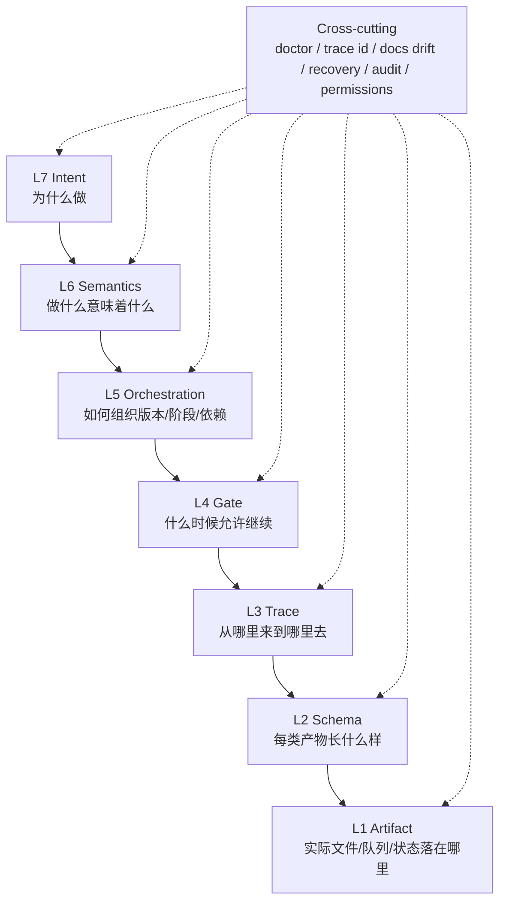

# AreaMatrix Workflow Architecture

本文描述 AreaMatrix workflow 的概念架构。它不是产品文档，不定义产品行为；产品源事实仍然是 `docs/`。它也不是 live 任务队列；真正可执行的任务仍然在 `tasks/prompts/**`。

workflow 的职责是把已经讨论清楚的产品意图，稳定地转成可追踪、可检查、可推广、可验收的小任务。

## Three Views

AreaMatrix workflow 分成三种视角：

- **Architecture layers**：系统由哪些抽象层组成。
- **Workflow pipeline**：工作如何从 docs 流向 task-loop。
- **Cross-cutting capabilities**：每一层都需要具备的稳定性能力。

这三者不能混在一起。层级用于设计系统，pipeline 用于跑事情，横切能力用于保证长期稳定。

## Architecture Layers

七层模型描述的是抽象依赖关系，不是执行步骤。下层提供承载、结构和追踪能力，上层表达语义、编排和意图。

| Layer | Name | Core Question | Owns |
| --- | --- | --- | --- |
| L7 | Intent Layer | 为什么做这个版本或能力？ | 用户目标、版本目标、业务动机、成功定义 |
| L6 | Semantics Layer | docs 里的语义到底意味着什么？ | 产品语义、non-goals、风险边界、验收含义 |
| L5 | Orchestration Layer | 如何组织成版本、阶段和依赖？ | changes/plans/drafts 的组织策略、phase 边界、依赖顺序 |
| L4 | Gate Layer | 什么时候允许进入下一层？ | discussion gate、plan doctor、draft doctor、promotion approval |
| L3 | Trace Layer | 每个产物从哪里来，到哪里去？ | docs -> change -> plan -> draft -> queue -> task -> result 的追踪关系 |
| L2 | Schema Layer | 每类产物长什么样？ | discussion、change、plan、draft、queue、promotion、runtime 的字段契约 |
| L1 | Artifact Layer | 东西实际落在哪里？ | `docs/`、`workflow/versions/v*/`、`tasks/prompts/**`、progress、logs、checkpoints |

## Layer Responsibilities

### L7 Intent Layer

意图层回答“为什么存在”。它不拆任务，也不决定文件结构，只确认版本目标、用户目标、成功标准和优先级。

### L6 Semantics Layer

语义层把 `docs/` 中的产品描述讨论成稳定含义，包括：

- confirmed facts：docs 已明确的事实。
- assumptions：可接受但需要标记的假设。
- open questions：还不能下结论的问题。
- conflicts：docs、目标或边界之间的冲突。
- non-goals：本轮明确不做的内容。
- acceptance boundary：本轮做到什么程度才算完成。

### L5 Orchestration Layer

编排层决定如何把已确认语义组织成版本工作流。它关注阶段、依赖、风险顺序、并行边界和验证策略。

### L4 Gate Layer

门禁层把“可以继续吗”变成可检查规则。每个 gate 都应有明确的 pass/fail 条件和失败后的回退位置。

### L3 Trace Layer

追踪层保证任意 live task 都能反查来源：

```text
task -> queue -> draft -> plan -> change -> middle-layer -> docs discussion -> docs source
```

追踪关系缺失时，后续验收不能宣称完整。

### L2 Schema Layer

结构层定义每类产物的最小字段、状态枚举、必填项和引用格式。schema 的目标不是增加形式感，而是让 doctor 可以机器检查。

### L1 Artifact Layer

产物层只负责承载，不负责改变语义。`workflow/` 可以记录、拆分和追踪产品意图，但不能替代 `docs/` 成为产品源事实。

## Workflow Pipeline

实际流转路径如下：

```text
version init
-> docs baseline snapshot
-> docs discussion
-> decision gate
-> middle-layer ledger
-> changes ledger
-> workflow plans
-> plan doctor
-> task drafts
-> draft doctor
-> queue candidates
-> queue doctor
-> promotion preview
-> promotion approval
-> explicit promote
-> tasks/prompts
-> prompt pipeline doctor/render/status
-> task-loop execute/verify/repair/checkpoint
-> result projection
-> closeout/audit
```

关键边界：

- `docs discussion` 到 `decision gate` 之前，只讨论源事实，不生成 live tasks。
- `promotion preview` 只做 dry-run，不写 `tasks/prompts/**`。
- `explicit promote` 是进入 live 队列的唯一动作。
- `task-loop` 只执行已批准的 live queue，不负责需求讨论或 promotion 审批。

详细的阶段契约、失败回退、状态语义和执行流转图见 [`pipeline.md`](pipeline.md)。

## Cross-Cutting Capabilities

这些能力贯穿所有层，不单独成为第八层：

- **Doctor checks**：每层都有机器可检查的 pass/fail 规则。
- **Trace id**：每个产物都能反查来源和下游影响。
- **Docs drift**：源 docs 变化后，相关 discussion/change/plan/draft 需要回审。
- **Recovery**：每个失败状态都有明确回退位置。
- **Audit**：关键决策、promotion、checkpoint 和 closeout 留下可验收证据。
- **Permissions**：promotion、apply、closeout 等动作必须显式授权。

## Boundary Rules

- `docs/` 是产品源事实；workflow 不替代 docs。
- `workflow/versions/v*/discussion/` 是讨论和决策入口；未过 gate 不进入 `changes/`。
- `middle-layer/` 是翻译和映射账本；它不能重新定义产品语义。
- `changes/` 记录“要变什么”；`plans/` 记录“如何组织执行”。
- `drafts/` 和 `queue/` 仍是候选材料，不是 live execution scope。
- `promotion/` 先 preview，再 approval，最后 explicit promote。
- `tasks/prompts/**` 是 task-loop 可消费的真实队列。
- `result projection` 和 `closeout/audit` 用于把执行结果回写到 workflow 视角。

## Stability Criteria

一个 v* workflow 只有同时满足以下条件，才算稳定：

- 能从 task 反查到 docs source。
- 每层都有最小 schema 和 doctor gate。
- preview 与 promote 强分离。
- docs drift 能触发回审。
- task-loop 结果能投影回 change/plan/draft 状态。
- 失败后能知道回到哪一层修复。

## Mermaid Overview


