# AreaMatrix Workflow Pipeline

本文描述 AreaMatrix workflow 的执行流转路径。它不是产品文档，不定义产品行为；产品源事实仍然是 `docs/`。它也不是抽象分层模型；抽象层级见 [`architecture.md`](architecture.md)。

pipeline 的职责是说明：一个版本或大功能如何从 docs 讨论，逐步进入账本、计划、草稿、候选队列、promotion preview，最后变成 `tasks/prompts/**` 中可由 task-loop 执行和验收的 live 任务。

## Pipeline Overview

```text
version init
-> docs baseline snapshot
-> docs discussion
-> decision gate
-> middle-layer ledger
-> changes ledger
-> workflow plans
-> plan doctor
-> task drafts
-> draft doctor
-> queue candidates
-> queue doctor
-> promotion preview
-> promotion approval
-> explicit promote
-> tasks/prompts
-> prompt pipeline doctor/render/status
-> task-loop execute/verify/repair/checkpoint
-> result projection
-> closeout/audit
```

这条链路分成五段：

- **Discussion segment**：从 version init 到 decision gate，目标是把 docs 源事实讨论清楚。
- **Ledger segment**：从 middle-layer ledger 到 changes ledger，目标是记录 docs 如何变成变更单元。
- **Planning segment**：从 workflow plans 到 queue candidates，目标是把变更组织成可执行任务候选。
- **Promotion segment**：从 promotion preview 到 tasks/prompts，目标是安全进入 live 队列。
- **Execution segment**：从 prompt pipeline checks 到 closeout/audit，目标是执行、验收、修复、checkpoint 和回写。

## Stage Contracts

每个阶段都应有明确输入、输出、门禁和失败回退位置。

### 1. version init

**Purpose**：初始化一个 v* workflow skeleton。

**Input**：

- 版本号，例如 `v3`。
- 版本意图的初步描述。

**Output**：

- `workflow/versions/v*/version.yaml`
- `workflow/versions/v*/discussion/`
- `workflow/versions/v*/middle-layer/`
- `workflow/versions/v*/changes/`
- `workflow/versions/v*/plans/`
- `workflow/versions/v*/drafts/`
- `workflow/versions/v*/queue/`
- `workflow/versions/v*/promotion/`

**Gate**：

- 默认 preview-first。
- 只有显式 `--write` 才落盘。
- 只有显式 `--force` 才覆盖既有 skeleton。

**Failure return**：停在 init，不进入 discussion。

### 2. docs baseline snapshot

**Purpose**：记录本轮讨论基于哪些 docs 源事实，防止后续 docs drift。

**Input**：

- `docs/**` 中本轮相关文件和章节。

**Output**：

- Exact Docs 路径。
- 可选的章节引用、行号、hash 或 source refs。

**Gate**：

- Exact Docs 必须非空。
- 每个路径必须存在。
- 后续 discussion、changes、drafts 必须能反查到这些 docs source。

**Failure return**：回到 docs selection，重新确认范围。

### 3. docs discussion

**Purpose**：讨论产品源事实，不生成任务。

**Input**：

- docs baseline snapshot。
- 用户目标和版本意图。

**Output**：

- confirmed facts。
- assumptions。
- open questions。
- conflicts。
- non-goals。
- acceptance boundary。

**Gate**：

- 不写 `tasks/prompts/**`。
- 不生成 copy-ready / verify-ready prompts。
- 不把 workflow 文档当成产品源事实。

**Failure return**：继续讨论 docs，直到争议收敛或明确 deferred。

### 4. decision gate

**Purpose**：决定是否允许进入后续账本层。

**Input**：

- `docs-discussion.md`
- `middle-layer-discussion.md`
- `decisions.yaml`

**Output**：

- `allow_changes: true` 或保持 blocked。
- 已解决、接受、关闭、延期或不适用的 open questions/blockers。
- 明确的 risk boundaries。

**Gate**：

- `allow_changes: true`。
- Exact Docs 非空且路径存在。
- `docs-discussion.md` 提到每个 Exact Docs 路径。
- open questions 和 blockers 没有 unresolved 项。
- risk boundaries 非空。

**Failure return**：回到 docs discussion。

### 5. middle-layer ledger

**Purpose**：把 docs 语义翻译成后续工作结构。

**Input**：

- 通过 decision gate 的 discussion 结果。

**Output**：

- feature-level implementation intent。
- Exact Docs 行号或章节引用。
- 插入点。
- 相关 feature links。
- 代码影响。
- 依赖。
- slice 计划。
- 风险边界。

**Gate**：

- 不能替代 `docs/` 定义产品语义。
- 每个 middle-layer entry 必须能反查 docs source。
- 必须能说明如何承接到 changes、plans、drafts、queue 和 promotion。

**Failure return**：回到 middle-layer ledger 修正；若产品语义不清，回到 docs discussion。

### 6. changes ledger

**Purpose**：记录“要变什么”。

**Input**：

- middle-layer ledger。
- docs references。

**Output**：

- change id。
- change scope。
- docs references。
- dependencies。
- affected surfaces。
- risk notes。

**Gate**：

- changes 不写执行 prompt。
- changes 不重新定义产品语义。
- changes 与 middle-layer ledger 必须一致。

**Failure return**：回到 changes ledger；若映射错误，回到 middle-layer ledger。

### 7. workflow plans

**Purpose**：记录“如何组织执行”。

**Input**：

- changes ledger。
- version dependencies。
- risk boundaries。

**Output**：

- phases。
- task groups。
- dependency order。
- validation strategy。
- parallelization boundary。
- rollback/recovery notes。

**Gate**：

- 不抢 live task label。
- 不写 `tasks/prompts/**`。
- 每个 plan item 都能追踪到 change。

**Failure return**：回到 plans。

### 8. plan doctor

**Purpose**：机器检查 plan 是否足够进入 task draft。

**Checks**：

- 依赖完整。
- phase 边界清楚。
- 验收边界清楚。
- docs/change trace 完整。
- risk boundary 已覆盖。

**Failure return**：回到 workflow plans。

### 9. task drafts

**Purpose**：把 plan 拆成小颗粒度 prompt 草稿。

**Input**：

- workflow plans。
- changes ledger。
- Exact Docs。

**Output**：

- draft task label。
- Exact Docs。
- Expected Paths。
- copy-ready prompt。
- verify-ready prompt。
- forbidden scope。
- verification commands。

**Gate**：

- draft 仍不是 live task。
- 每个 draft 必须小到可独立执行和验收。
- Expected Paths 不能空。
- verify-ready 必须能独立判断 pass/fail。

**Failure return**：回到 task drafts；如果粒度错误，回到 workflow plans。

### 10. draft doctor

**Purpose**：机器检查 drafts 是否可进入候选队列。

**Checks**：

- Exact Docs 存在。
- Expected Paths 完整。
- Verify Commands 存在且范围合理。
- copy-ready 与 verify-ready 边界一致。
- 无 scope bleed。

**Failure return**：回到 task drafts。

### 11. queue candidates

**Purpose**：形成 version-local 候选执行顺序。

**Input**：

- 通过 draft doctor 的 task drafts。

**Output**：

- version-local queue labels，例如 `phase-0 / 0-1 / task-01`。
- depends_on。
- blocked_by。
- promotion readiness。

**Gate**：

- version-local 编号不等于 live label。
- live mapping 仍可保持 pending。
- 不能写 `tasks/prompts/**`。

**Failure return**：回到 queue candidates；如果任务边界错误，回到 drafts。

### 12. queue doctor

**Purpose**：检查候选队列是否可进入 promotion preview。

**Checks**：

- label 不冲突。
- 依赖没有断裂。
- 顺序符合 plan。
- 每个 queue item 都能反查 draft。
- promotion readiness 明确。

**Failure return**：回到 queue candidates。

### 13. promotion preview

**Purpose**：dry-run 预览候选队列进入 live `tasks/prompts/**` 的结果。

**Input**：

- queue candidates。
- live task label policy。
- existing `tasks/prompts/**` 状态。

**Output**：

- live label mapping preview。
- files-to-create preview。
- manifest impact preview。
- scope check。
- collision check。

**Gate**：

- preview 不写 live files。
- preview 不修改 progress。
- preview pass 不等于 promote。

**Failure return**：回到 drafts 或 queue candidates，取决于失败来源。

### 14. promotion approval

**Purpose**：显式确认是否允许把 preview 结果推广到 live 队列。

**Input**：

- promotion preview result。
- risk summary。
- expected live changes。

**Output**：

- approved / rejected / deferred。

**Gate**：

- 没有 approval 不允许 explicit promote。
- 高风险或映射不确定时保持候选状态。

**Failure return**：回到 queue candidates 或 promotion preview。

### 15. explicit promote

**Purpose**：真正写入 live `tasks/prompts/**`。

**Input**：

- approved promotion preview。

**Output**：

- live task files。
- live manifest updates。
- live mapping records。

**Gate**：

- 必须是显式动作。
- 必须保留 preview evidence。
- 必须保持 live label 全局唯一。

**Failure return**：停止 promote，并恢复到 promotion preview / queue candidates 状态。

### 16. tasks/prompts

**Purpose**：承载 task-loop 可消费的真实任务。

**Input**：

- explicit promote 生成的 live tasks。

**Output**：

- copy-ready prompts。
- verify-ready prompts。
- manifests。
- progress-compatible live queue。

**Gate**：

- live task 必须有 manifest 边界。
- live task 必须有 copy-ready 和 verify-ready。
- live task 必须能追踪到 workflow source。

**Failure return**：回到 live prompt 修正；必要时回到 promotion preview。

### 17. prompt pipeline doctor/render/status

**Purpose**：检查 live prompt 体系能否被 task-loop 正确消费。

**Checks**：

- prompt pipeline doctor。
- render。
- status。
- manifest consistency。
- Missing Expected Paths。

**Failure return**：回到 `tasks/prompts/**` 修正；若源头错，回到 drafts 或 queue。

### 18. task-loop execute/verify/repair/checkpoint

**Purpose**：执行 live task 并完成验收闭环。

**Flow**：

```text
copy-ready execute
-> verify-ready verify
-> fail: repair current task
-> verify again
-> pass: checkpoint
-> next task
```

**Gate**：

- verify pass 才能进入 checkpoint。
- checkpoint 必须拒绝 scope drift。
- dirty worktree、越界文件、gate fail 都应 blocked，而不是伪装 pass。

**Failure return**：留在当前 live task 修复重验。

### 19. result projection

**Purpose**：把 task-loop 结果回写到 workflow 视角。

**Input**：

- task-loop progress。
- checkpoint result。
- verification evidence。

**Output**：

- change status projection。
- plan status projection。
- draft status projection。
- queue/promotion status projection。

**Gate**：

- 不能只看单个 task pass。
- 必须能说明对应 change/plan 是否完成、blocked 或 partially done。

**Failure return**：回到 result projection 修正；若 runtime 不一致，回到 task-loop status audit。

### 20. closeout/audit

**Purpose**：最终确认 workflow 状态与执行结果一致。

**Input**：

- result projection。
- live progress。
- validation evidence。
- checkpoint evidence。

**Output**：

- closeout decision。
- remaining risks。
- blocked items。
- archive readiness。

**Gate**：

- 无法证明通过，就不能宣称 complete。
- workflow、live queue、task-loop runtime 必须一致。
- 未验证项必须明确留下。

**Failure return**：回到 result projection、task-loop 或对应上游修复层。

## Failure Routing

失败不能只标记为 fail；必须知道回到哪里修。

| Failure | Return To |
| --- | --- |
| docs path missing | docs baseline snapshot |
| unresolved open question | docs discussion |
| `allow_changes: false` | decision gate / docs discussion |
| middle-layer 与 docs 不一致 | middle-layer ledger 或 docs discussion |
| changes 与 middle-layer 不一致 | changes ledger |
| plan 依赖断裂 | workflow plans |
| draft 缺 Expected Paths | task drafts |
| draft verify 边界不清 | task drafts |
| queue label 冲突 | queue candidates |
| promotion preview 撞名 | queue candidates |
| promotion scope bleed | task drafts 或 queue candidates |
| prompt manifest 不一致 | `tasks/prompts/**` |
| verify fail | 当前 live task repair |
| checkpoint scope drift | 当前 live task repair / checkpoint gate |
| result projection 不一致 | result projection / task-loop status audit |
| closeout 证据不足 | closeout/audit 或对应上游层 |

## State Model

建议所有 pipeline artifact 尽量使用少量状态：

- `draft`：已创建，但未通过对应 doctor。
- `ready`：通过当前层 gate，可进入下一层。
- `blocked`：存在 unresolved blocker。
- `deferred`：明确延期，不阻塞当前目标。
- `promoted`：已进入 live `tasks/prompts/**`。
- `done`：执行和验收已完成。
- `superseded`：被后续版本或变更替代。

状态语义必须来自源 runtime 或机器检查结果，不能为了显示好看手写绿色状态。

## Trace Requirements

任意 live task 至少要能反查：

```text
live task label
-> promotion mapping
-> queue candidate
-> draft id
-> plan item
-> change id
-> middle-layer entry
-> docs discussion
-> Exact Docs
```

缺少 trace 时，验收报告应判定为证据不足。

## Mermaid Overview

```mermaid
flowchart TD
  A["version init<br/>初始化 v* workflow skeleton<br/>preview-first / --write 才落盘"]
  B["docs baseline snapshot<br/>记录 docs 章节 / hash / source refs<br/>防止后续文档漂移"]
  C["docs discussion<br/>源事实讨论<br/>Exact Docs / non-goals / open questions / acceptance boundary"]
  D{"decision gate<br/>讨论门禁"}

  E["middle-layer ledger<br/>中间层账本<br/>docs -> changes / plans / drafts / queue / promotion 映射"]
  F["changes ledger<br/>变更账本<br/>记录要变什么 / docs 引用 / trace id"]
  G["workflow plans<br/>整体 workflow 计划<br/>阶段 / 依赖 / 风险 / 验收边界"]
  H{"plan doctor<br/>计划检查"}

  I["task drafts<br/>小颗粒度任务草稿<br/>Expected Paths / Verify Commands / 禁止越界"]
  J{"draft doctor<br/>草稿检查"}
  K["queue candidates<br/>候选队列<br/>version-local phase/task 编号"]
  L{"queue doctor<br/>队列检查"}

  M["promotion preview<br/>推广预览<br/>dry-run 映射 / 撞名检查 / scope 检查"]
  N{"promotion approval<br/>推广确认"}
  O["explicit promote<br/>显式推广<br/>写入 live tasks/prompts"]

  P["tasks/prompts<br/>真实任务库<br/>task-loop 可消费"]
  Q{"prompt pipeline doctor/render/status<br/>任务库检查"}
  R["task-loop<br/>execute / verify / repair / checkpoint"]

  S["result projection<br/>结果回写<br/>change / plan / draft 完成状态投影"]
  T["closeout / audit<br/>最终收口<br/>确认 workflow 与执行结果一致"]

  A --> B
  B --> C
  C --> D

  D -- "未通过：blockers / open questions / scope 冲突" --> C
  D -- "通过：allow_changes=true" --> E

  E --> F
  F --> G
  G --> H

  H -- "fail：依赖缺失 / 验收边界不清 / scope 不完整" --> G
  H -- "pass" --> I

  I --> J
  J -- "fail：Expected Paths 缺失 / Verify Commands 不足 / 越界" --> I
  J -- "pass" --> K

  K --> L
  L -- "fail：顺序冲突 / label 冲突 / 依赖断裂" --> K
  L -- "pass" --> M

  M -- "preview fail：撞名 / 缺 manifest / scope bleed / 缺验证" --> I
  M -- "preview pass" --> N

  N -- "未确认：保持候选状态" --> K
  N -- "确认 promote/apply" --> O

  O --> P
  P --> Q
  Q -- "fail：prompt manifest/render/status 不一致" --> P
  Q -- "pass" --> R

  R -- "verify fail：修复后重验" --> R
  R -- "checkpoint fail：scope drift / dirty worktree / gate fail" --> R
  R -- "pass + checkpoint" --> S

  S --> T
  S --> F

  B -. "docs drift/hash changed<br/>触发回审" .-> C
```


